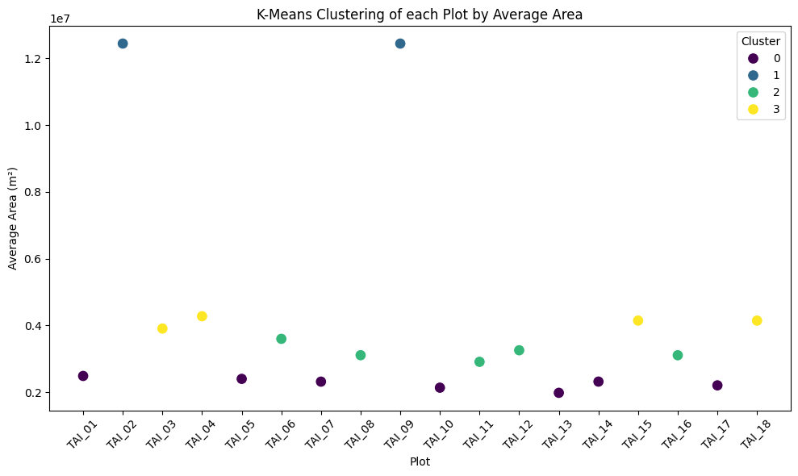

# Data-Science-and-machine-learning-for-the-biosciences-Assessment
Data Science and machine learning for the biosciences – Assessment
## Analysis and predictions regarding the characteristics of my research area based on satellite images, before commencing fieldwork
## Introduction/Motivation

## Results
# 

#### Clustering
## Summary/conclusions
