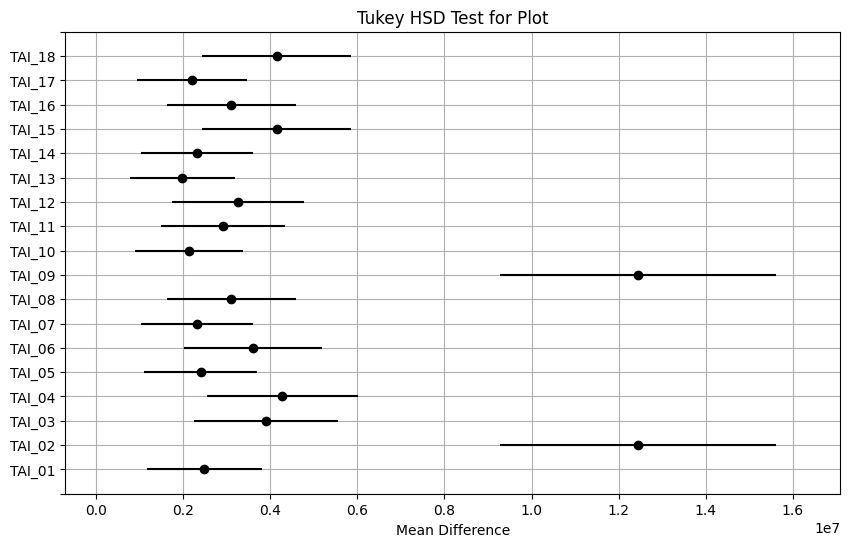
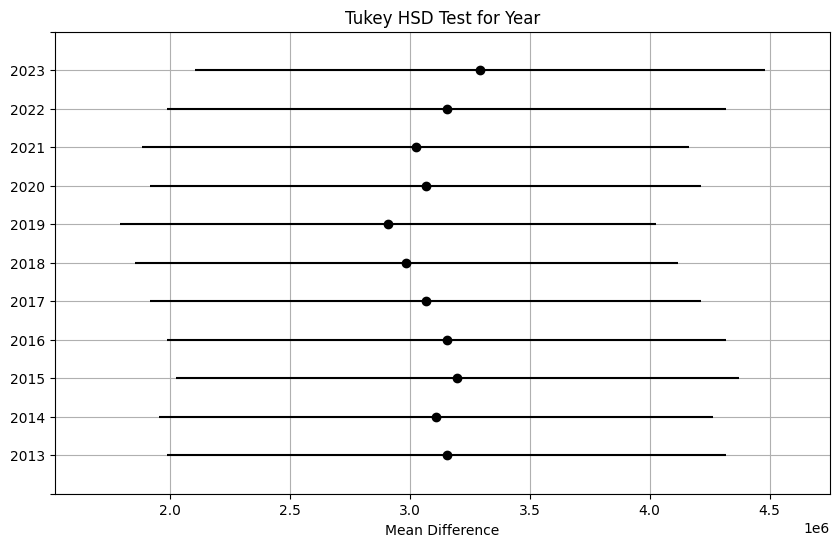
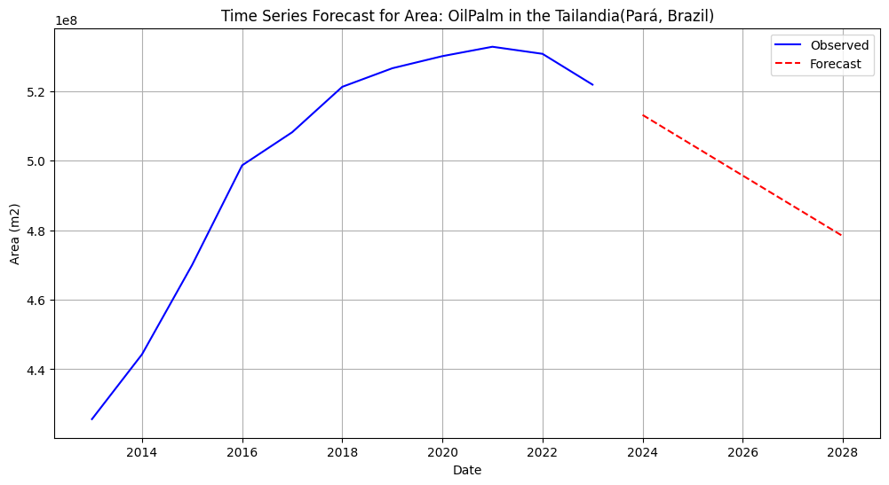
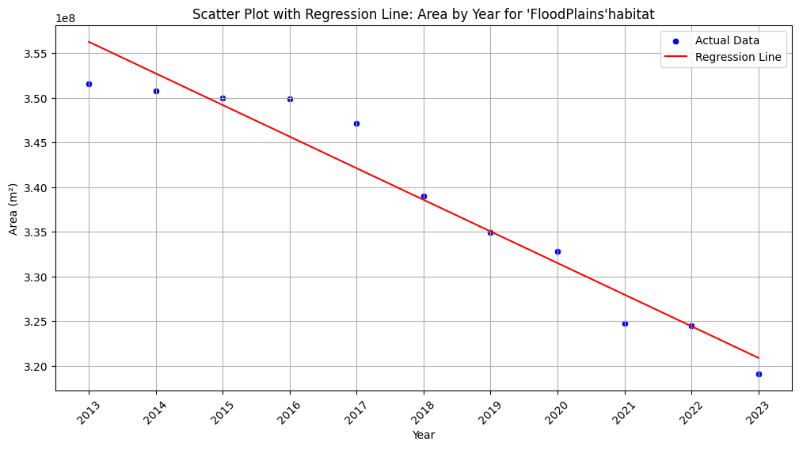

# Data-Science-and-machine-learning-for-the-biosciences-Assessment

# Analysis and predictions regarding the characteristics of my research area based on satellite images, before commencing fieldwork

## INTRODUCTION

## METHODS

### - The data was obtained using Google Earth Engine (GEE), with the Mapbiomas User Toolkit for maps in Brazil.
### - The database was created by Elizabeth Renteria
### - Data set Book1. is a data set about 18 diferent sites (plots) from the Amazon forest in Brazil. These 18 transects are the same size, a radius of 2km, but each have a different composition of habitat type. Each of them can have a different combination between 11 habitat types. Having a maximal of 6 combination and a minimun or 1 single type. The measurements from the different habitat types in each transect was obtain using Google Earth Engine with satelitte images from 2013-2023 
### - I used a second data (centerb) base to explore a bigger area than contains all 18 plots plus the area between the plots. An area of 30,000 m2 radius. I found it important to also analize this data base, because it can contain information thta is important to undertand the main land use differences in the whole area and not only snips of it.

## Data Analysis
### ---- The code for this Analysis can be find in the files with the name final_project.ipynb 
### - I used Python to analize and visualize the data.
### - First, I used clustering to explore the data with k-means.
### - Second, I created a Heatmap because the cluster plot is not very specific, so it would be better to have a heatmap, so we can see with more detail the difference in habitat composition.
### - Third, perform an ANOVA to see if the differences in the heatmaps are significant
### - Fourth, perform a time series analysis with a 5 year forecast, using the ARIMA function. I only used the first plot from the first database to show the forecast, because 18 plot is too long to plot.
### - Fifth, perform a linear regression only in the secon data base, to see the relationship between the area of the 4 most important habitat types in the last 11 years.

## RESULTS

## Clusters


### This plot should plot the 4 clusters of the Area in squared meters of each plot(BufferID). But since each of the transects have the same Area and only changes the type of habitat, I can argue that the plot actually could represent the levels of homogenity or heterogenity of the plot. Cluster 1 are the more homogenous so they have more area because its only distributed in 1 habitat type. Cluster 0 are plots that have their area divided in 5 or 6 habitat types. Cluster 2, 3-4 habitat types. Cluster 3, 2-3 habitat types (18 plots).


### Here the cluster plot indicates which habitat type has more area in total, in the big area that encompas the 18 plots. We can see that in the big area "ForestFormation" has the biggest squared meter area, followed by "Pasture" and "OilPalm" (Tailandia, Para-Brazil).


## Heatmaps


### In this heatmap we can see that our main habitat type is "Forest formation" in most plots, followed by "OilPalm". We can also observed than a lot of the other habitat types contribute with less than 1 percent to the plots composition (18 plots).


### In this heatmap we can see that our main habitat type is "Forest formation" all Years, followed by "OilPalm". The percentages dont really change across the years (18 plots).


### HEAT MAP FOR HABITAT TYPE PER YEAR. #In the heatmap we can see that our main habitat type is "Forest formation" all Years, followed by "OilPalm". The percentages dont really change across the years (Tailandia, Para-Brazil).


## ANOVA

#####   ANOVA for Plot : F-statistic: 9.00751058069251, p-value: 1.3372846720700188e-21

### ANOVA for Plots. There is a significant difference between the plots, being plot TAI_02 and TAI_09 the ones that produce this difference. Plot TAI_02 and TAI_09 are the plots that are compound by only one habitat type (ForestFormation) (18 plots).
#
#####   ANOVA for Type: F-statistic: 464.7582383256251, p-value: 1.64e-321

### ANOVA for Habitat Type. There is a significant difference between the Habitat types, being ForestFormation and OilPalm the ones thta produce this difference. Both types are the one with the largest area_m2 (18 plots).
#
#####  ANOVA for Year: F-statistic: 0.04438257860079598, p-value: 0.9999961834517294

### ANOVA for Year. There was no a significant in the area differences between the 11 years (18 plots).
#
##### ANOVA for Habitat Type: F-statistic: 3518.154323541889, p-value: 5.477677187641807e-157

### ANOVA for Habitat Type (Tailandia, Para-Brazil): There is a significant difference between the Habitat types, being ForestFormation, Pastures, OilPalm, and Floodplains the ones that produce this difference. These types are the one with the largest area_m2. A difference can be noted between the whole area of the experiment and the selected plot. If only we take only the plots under accountance we get a false overview of the area, beacause the plots were selected to get a gradient of type of forest. But ForestFormation has by far the largest area. If we take also the whole area encompasing the plots, we can see that the area is actually pretty heterogenic, having a high area disturbance type habitats, like Pasture and Oilpalm.
#
##### ANOVA for Year: F-statistic: 4.867223506960202e-30, p-value: 1.0

### ANOVA for Year (Tailandia, Para-Brazil): There was no a significant in the area differences between the 11 years

## Time Analysis and Forecast


#### The area m2 of ForestFormation habitat type in the Plot TAI_01 , is expected to increase in the next 5 years. After checking the forecast by fittting an  ARIMA model on training data, I can conlude is accurate, since the forecast is inside the confidence interval (18 plots).
#

#### The area m2 of Pasture habitat type in the site (Tailandia-Brazil), are expected to grow in the next 5 years. After checking the forecast by fittting an  ARIMA model on training data, I can conlude is accurate, since the forecast is inside the confidence interval.
#

#### The area m2 of ForestFormation habitat type in the site (Tailandia-Brazil), is expected to decrease in the next 5 years. The forecast looks plausible, beacuse is inside the confidence intervals
#

#### The area m2 of OilPalm habitat type in the site (Tailandia-Brazil), is expected to decrease in the next 5 years, but after checking the forecast using the training data it seems to be increasing, I think that the discrepancy is due the OilPalm habitat decresing very recently, so the train data only shows an increasing (80%) and the test data is decreasing, but since the forescast is done with the first 80%, only shows a expected increase
#

#### The area m2 of Floodplains habitat type in the site (Tailandia-Brazil), is expected to decrease in the next 5 years. The forecast looks plausible, beacuse is inside the confidence intervals


## Linear Regression


#### ForestFormation. The linear regression indicates a signficative increase of 1.528e+07 m2 every year (ForestFormation area). The R-squared is high, so the variance can be explain by this model


#### OilPalm. The linear regression indicates a signficative increase of 9.968e+06 m2 every year (Oilpalm area). The R-squared is not that high, so  the variance cannot be fully explain by this model


#### Pasture. The linear regression indicates a signficative increase of 9.929e+06 m2 every year (Pasture area). The R-squared is not that high, so  the variance cannot be fully explain by this model


#### Floodplain.  The linear regression indicates a signficative decrease of Floofplains area of 3.537e+06 m2, every year. The high R-squared indicates that the variance can be explain by this model
```python

    


