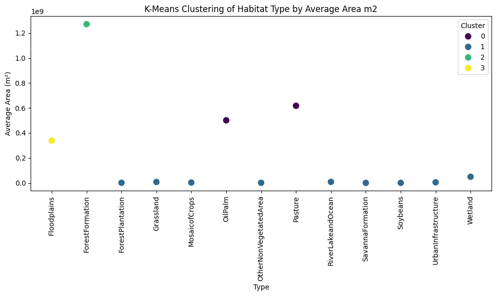
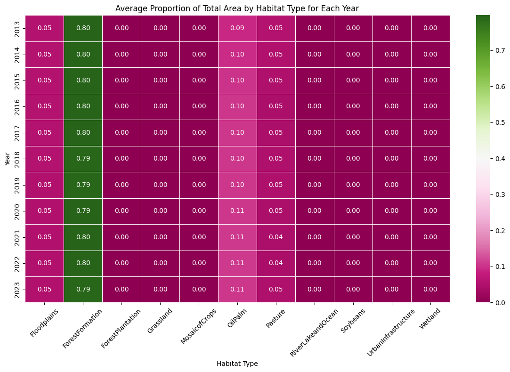
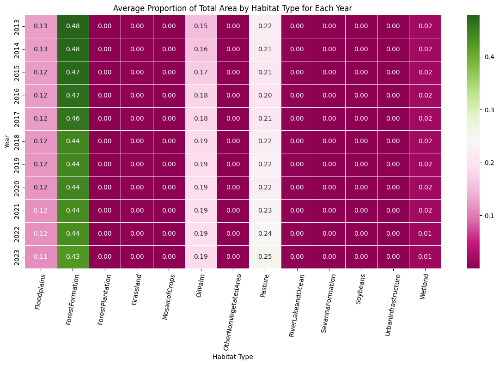
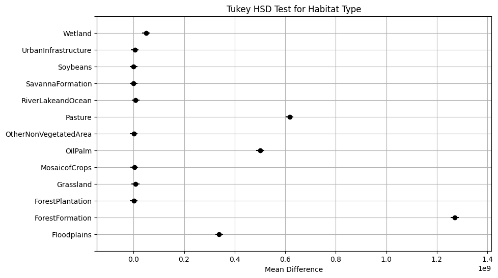
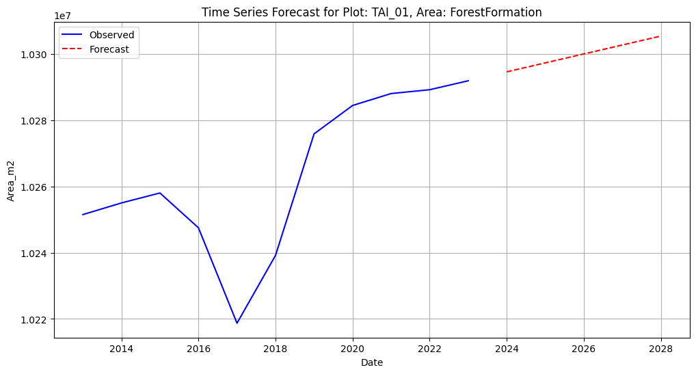
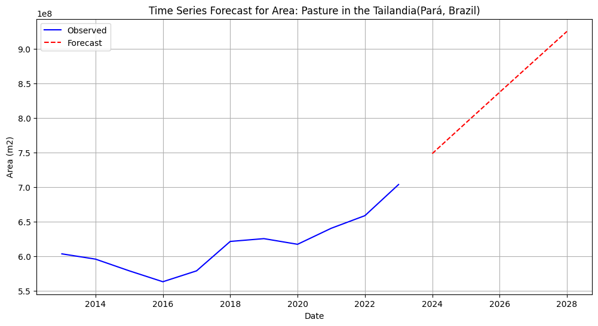
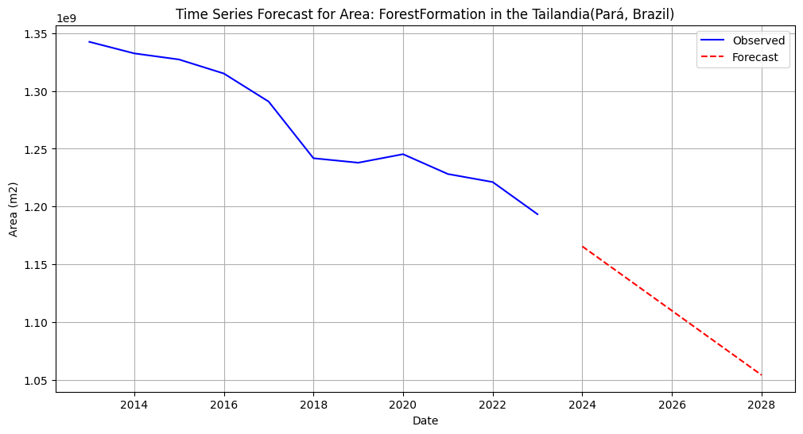
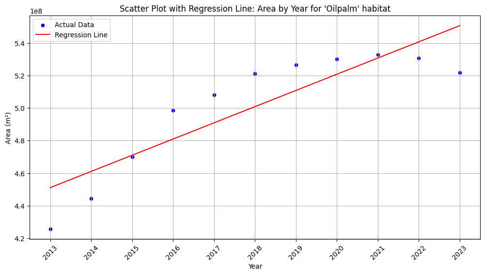

Data-Science-and-machine-learning-for-the-biosciences-Assessment

# Analysis and predictions regarding the characteristics of my research area based on satellite images, before commencing fieldwork

## INTRODUCTION/MOTIVATION
### The primary goal of this analysis is to provide an initial, comprehensive understanding of the research field site for my PhD project. This research area, located in the Amazon rainforest of Brazil, is critical for assessing the effects of habitat diversity and land use changes on the region’s biodiversity.
### Satellite imagery offers a unique opportunity to analyze and predict the characteristics of the area before physical fieldwork begins. By utilizing various satellite data sources, we aim to identify patterns in habitat composition, land use, and environmental changes over time. This analysis is essential for formulating hypotheses about the ecological dynamics at play in this region, particularly in relation to habitat fragmentation, deforestation, and the impact of human activities on biodiversity.
### By leveraging advanced data science and machine learning techniques, we can gain valuable insights into the spatial and temporal patterns within the landscape, helping us plan future field studies with a more focused and data-driven approach. Furthermore, the results from this analysis will serve as a foundation for future research questions, providing a clearer understanding of the environmental factors influencing the region. 

## METHODS
## Data Collection and Sources
### Data Source: The data was obtained using Google Earth Engine (GEE), specifically the Mapbiomas User Toolkit for generating maps in Brazil. This allowed access to high-resolution satellite imagery and environmental datasets spanning several years.
### Database Creation: The dataset was compiled and created by Elizabeth Renteria.

## Description of the Dataset
### Primary Dataset - Book1: This dataset consists of 18 distinct research plots located within the Amazon forest. Each plot has a radius of 2 km, and each plot contains a unique combination of habitat types. In total, there are 11 habitat types, with each plot containing anywhere from 1 to 6 different habitat types. Satellite images from the period of 2013-2023 were used to extract the measurements for each habitat type within these plots.

### Secondary Dataset - Centerb: To obtain a broader view of the landscape, I utilized an additional dataset that encompasses a larger area, incorporating all 18 plots along with the surrounding land in between. This expanded area has a 30,000 m² radius and provides a more comprehensive context for understanding land use patterns and habitat composition in the larger region. Analyzing this dataset is important as it helps to identify larger-scale land use changes and patterns that may not be apparent when looking at individual plots.

## Data Analysis
### -- Code Repository: The full code used for this analysis is available in the Jupyter Notebook file named final_project.ipynb. This notebook includes all necessary steps for data cleaning, visualization, and analysis.
### -- Data Processing and Visualization
### * Clustering with K-Means: To explore the data spatially, I first applied k-means clustering. This unsupervised machine learning algorithm helps group the research plots based on their similarity in habitat composition, allowing us to identify spatial patterns or areas of interest that share similar ecological characteristics.
### * Heatmap Generation: Although the clustering results provided initial insights, they lacked the fine-grained detail needed to fully understand habitat variations. As a result, I created heatmaps to visualize the distribution of habitat types across the area with more clarity. Heatmaps are particularly useful for showing variations in habitat composition over space, enabling a more detailed analysis of the landscape.
### * ANOVA Analysis: To assess whether the differences observed in the heatmaps were statistically significant, I conducted an Analysis of Variance (ANOVA). This test helps determine if the variations in habitat composition across different plots are significant or if they could be attributed to random variation. This step is crucial for validating the robustness of the results and understanding the degree of environmental variability in the region.
### * Time Series Forecasting (ARIMA): To investigate potential future trends in habitat dynamics, I performed a time series analysis using the ARIMA (AutoRegressive Integrated Moving Average) model. This model helps forecast future changes in habitat composition based on historical satellite data. For simplicity, I demonstrated this technique on the first plot from the primary dataset (Book1), as the 18 plots together would be too complex to display in a single model. The ARIMA model is designed to capture patterns and trends over time, providing a forecast for the next five years.
### * Linear Regression Analysis: Finally, I applied linear regression on the secondary dataset (Centerb) to explore the relationships between the area of the four most dominant habitat types and how they have changed over the past 11 years. This regression model aims to quantify the trends in land use and habitat composition, shedding light on potential drivers of ecological changes, such as deforestation or urbanization.

## RESULTS

## Clusters

### This plot should plot the 4 clusters of the Area in squared meters of each plot(BufferID). But since each of the transects has the same Area and only changes the type of habitat, I can argue that the plot actually could represent the levels of homogeneity or heterogeneity of the plot. Cluster 1 is the more homogenous so they have more area because it's only distributed in 1 habitat type. Cluster 0 are plots that have their area divided into 5 or 6 habitat types. Cluster 2, 3-4 habitat types. Cluster 3, 2-3 habitat types (18 plots).

### Here the cluster plot indicates which habitat type has more area in total, in the big area that encompasses the 18 plots. We can see that in the big area "ForestFormation" has the biggest squared meter area, followed by "Pasture" and "OilPalm" (Tailandia, Para-Brazil).

## Heatmaps

### In this heatmap we can see that our main habitat type is "Forest formation" in most plots, followed by "Oil palm". We can also observe that a lot of the other habitat types contribute less than 1 percent to the composition of the plot (18 plots).

#

### In this heatmap we can see that our main habitat type is "Forest formation" all Years, followed by "OilPalm". The percentages don't really change across the years (18 plots).

#

### HEAT MAP FOR HABITAT TYPE PER YEAR. #In the heatmap we can see that our main habitat type is "Forest formation" all Years, followed by "OilPalm". The percentages don't really change across the years (Tailandia, Para-Brazil).

## ANOVA

#####   ANOVA for Plot : F-statistic: 9.00751058069251, p-value: 1.3372846720700188e-21

### ANOVA for Plots. There is a significant difference between the plots, being plots TAI_02 and TAI_09 the ones that produce this difference. Plot TAI_02 and TAI_09 are the plots that are compounded by only one habitat type (ForestFormation) (18 plots).
#
#####   ANOVA for Type: F-statistic: 464.7582383256251, p-value: 1.64e-321

### ANOVA for Habitat Type. There is a significant difference between the Habitat types, ForestFormation and OilPalm are the ones that produce this difference. Both types are the ones with the largest area_m2 (18 plots).
#
#####  ANOVA for Year: F-statistic: 0.04438257860079598, p-value: 0.9999961834517294

### ANOVA for Year. There were no significant area differences between the 11 years (18 plots).
#
##### ANOVA for Habitat Type: F-statistic: 3518.154323541889, p-value: 5.477677187641807e-157

### ANOVA for Habitat Type (Tailandia, Para-Brazil): There is a significant difference between the Habitat types, being ForestFormation, Pastures, OilPalm, and Floodplains the ones that produce this difference. These types are the ones with the largest area_m2. A difference can be noted between the whole area of the experiment and the selected plot. If we take only the plots under account we get a false overview of the area, because the plots were selected to get a gradient of type of forest. But ForestFormation has by far the largest area. If we take also the whole area encompassing the plots, we can see that the area is pretty heterogenic, having a high area disturbance types habitats, like Pasture and Oilpalm.
#
##### ANOVA for Year: F-statistic: 4.867223506960202e-30, p-value: 1.0

### ANOVA for Year (Tailandia, Para-Brazil): There were no significant area differences between the 11 years

## Time Analysis and Forecast

#### The area m2 of ForestFormation habitat type in the Plot TAI_01, is expected to increase in the next 5 years. After checking the forecast by fitting an  ARIMA model on training data, I can conclude is accurate, since the forecast is inside the confidence interval (18 plots).
#

#### The area m2 of Pasture habitat type in the site (Tailandia-Brazil), is expected to grow in the next 5 years. After checking the forecast by fitting an  ARIMA model on training data, I can conclude is accurate, since the forecast is inside the confidence interval.
#

#### The area m2 of ForestFormation habitat type in the site (Tailandia-Brazil), is expected to decrease in the next 5 years. The forecast looks plausible because is inside the confidence intervals
#

#### The area m2 of OilPalm habitat type in the site (Tailandia-Brazil), is expected to decrease in the next 5 years, but after checking the forecast using the training data it seems to be increasing, I think that the discrepancy is due to the OilPalm habitat decreasing very recently, so the train data only shows an increasing (80%) and the test data is decreasing, but since the forecast is done with the first 80%, only shows an expected increase
#

#### The area m2 of Floodplains habitat type in the site (Tailandia-Brazil), is expected to decrease in the next 5 years. The forecast looks plausible because is inside the confidence intervals

## Linear Regression

#### ForestFormation. The linear regression indicates a significant increase of 1.528e+07 m2 every year (ForestFormation area). The R-squared is high, so the variance can be explained by this model

#### OilPalm. The linear regression indicates a significant increase of 9.968e+06 m2 every year (Oilpalm area). The R-squared is not that high, so  the variance cannot be fully explained by this model

#### Pasture. The linear regression indicates a significant increase of 9.929e+06 m2 every year (Pasture area). The R-squared is not that high, so  the variance cannot be fully explained by this model

#### Floodplain.  The linear regression indicates a significative decrease of Floodplains area of 3.537e+06 m2, every year. The high R-squared indicates that the variance can be explained by this model

## CONCLUSIONS

### This analysis provides key insights into the habitat composition and land use trends within the Amazon region of Brazil:

### - ForestFormation is the dominant habitat across most plots but is expected to decrease over the next 5 years, based on time series forecasts. This indicates a potential decline in this critical habitat, which is concerning for biodiversity.

### - Pasture and OilPalm habitats are expected to increase in some areas. This reflects ongoing land use change, with Pasture expanding and OilPalm potentially continuing its spread, although some discrepancies in forecasts suggest complexities in modeling these habitat dynamics.

### - Cluster analysis highlighted differences in habitat homogeneity across plots. Some plots are dominated by a single habitat type (ForestFormation), while others show more diverse land use patterns with multiple habitat types.

### - Linear regression models indicate that ForestFormation is expanding in some areas, but the overall trend suggests a decline, while Pasture and OilPalm are growing, contributing to the shift toward disturbance-prone habitats.

### These findings underscore the need for ongoing monitoring of habitat trends, particularly in light of the expected decline in ForestFormation and the increasing presence of Pasture and OilPalm, which could have long-term ecological consequences. Future fieldwork will be essential to validate these predictions and further explore the impacts of these habitat changes on the region’s biodiversity.

