# Data-Science-and-machine-learning-for-the-biosciences-Assessment
Data Science and machine learning for the biosciences – Assessment
## Analysis and predictions regarding the characteristics of my research area based on satellite images, before commencing fieldwork
## Introduction


```python
import pandas as pd
import threadpoolctl
import StandardScaler
import matplotlib.pyplot as plt
from statsmodels.stats.multicomp import pairwise_tukeyhsd
import matplotlib
from sklearn.cluster import KMeans
import seaborn as sns
from sklearn.preprocessing import StandardScaler
from scipy.stats import f_oneway
import statsmodels.api as sm
from statsmodels.formula.api import ols
import itertools
import statsmodels.formula.api as smf
from statsmodels.stats.multitest import multipletests
from statsmodels.stats.anova import anova_lm
from itertools import combinations
from statsmodels.tsa.arima.model import ARIMA
from sklearn.metrics import mean_absolute_error, mean_squared_error
import numpy as np
from sklearn.linear_model import LinearRegression
```


```python
#############################################################################################################################################################

#Data set Book1. is a data set about 18 diferent sites (plots) from the Amazon forest in Brazil. 
#These 18 transects are the same size, a radius of 2km, but each have a different composition of habitat type.
#Each of them can have a different combination between 11 habitat types. Having a maximal of 6 combination and a minimun or 1 single type.
#The measurements from the different habitat types in each transect was obtain using Google Earth Engine with satelitte images from 2013-2023 

df = pd.read_excel(r"C:\Users\vs24904\OneDrive - University of Bristol\Documents\Book1.xlsx")

##############################               First, I am going to use some clustering to explore the data            ##################################

# Group by BufferID and calculate the average area
df_avg_area = df.groupby('BufferID')['Area_m2'].mean().reset_index()
# Standardize the data
scaler = StandardScaler()
df_avg_area_scaled = scaler.fit_transform(df_avg_area[['Area_m2']])

# Apply K-Means clustering
kmeans = KMeans(n_clusters=4, random_state=0)
df_avg_area['Cluster'] = kmeans.fit_predict(df_avg_area_scaled)

# Plot the clusters

plt.figure(figsize=(10, 6))
sns.scatterplot(x='BufferID', y='Area_m2', hue='Cluster', data=df_avg_area, palette='viridis', s=100)
plt.title('K-Means Clustering of each Plot by Average Area')
plt.xlabel('Plot')
plt.ylabel('Average Area (m²)')
plt.legend(title='Cluster')
plt.xticks(rotation=45)
plt.tight_layout()
plt.savefig('K-Means Clustering of Buffer Zones by Average Area (18plots).png')
plt.show()
#This plot should plot the 4 clusters of the Area in squared meters of each plot(BufferID). 
#But since each of the transects have the same Area and only changes the type of habitat, I can argue that the plot actually could represent the levels of
#homogenity or heterogenity of the plot. 
#Cluster 1 are the more homogenous so they have more area because its only distributed in 1 habitat type
#Cluster 0 are plots that have their area divided in 5 or 6 habitat types
#Cluster 2, 3-4 habitat types
#Cluster 3, 2-3 habitat types 


##########################################################          HEATMAP          ######################################################################

#Actually the cluster plot is not very specific, so it would be better to have a heatmap, so we can see with more detail the difference in habitat composition

#########   HEAT MAP FOR HABITAT TYPE PER PLOT

# Aggregate by BufferID and Areas to calculate the average proportion across all years
df_avg_proportion = df.groupby(['BufferID', 'Type'])['Area_m2'].sum().reset_index()
# Calculate the proportion of Area_m2 for each Area within each Plot
df_avg_proportion['Proportion'] = df_avg_proportion.groupby('BufferID')['Area_m2'].transform(lambda x: x / x.sum())
# Pivot the data for heatmap
df_pivot_avg = df_avg_proportion.pivot_table(values='Proportion', index='BufferID', columns='Type', fill_value=0)

#Plot the heatmap
#In the heatmap we can see that our main habitat type is "Forest formation" in most plots, followed by "OilPalm".
#We can also observed than a lot of the other habitat types contribute with less than 1 percent to the plots composition.
plt.figure(figsize=(12, 8))
sns.heatmap(df_pivot_avg, cmap='PiYG', annot=True, fmt='.2f', linewidths=0.5)
plt.title('Average Proportion of Total Area by Habitat Type for Each Plot')
plt.xlabel('Habitat Type')
plt.ylabel('Plot')
plt.xticks(rotation=45)
plt.tight_layout()
plt.savefig('HEAT MAP FOR HABITAT TYPE PER PLOT (18plots).png')
plt.show()


#########   HEAT MAP FOR HABITAT TYPE PER YEAR

# Aggregate by BufferID and Areas to calculate the average proportion across all years
df_avg_proportion = df.groupby(['Date', 'Type'])['Area_m2'].sum().reset_index()
# Calculate the proportion of Area_m2 for each Area within each Plot
df_avg_proportion['Proportion'] = df_avg_proportion.groupby('Date')['Area_m2'].transform(lambda x: x / x.sum())
# Pivot the data for heatmap
df_pivot_avg = df_avg_proportion.pivot_table(values='Proportion', index='Date', columns='Type', fill_value=0)

#Plot the heatmap
#In the heatmap we can see that our main habitat type is "Forest formation" all Years, followed by "OilPalm".
#The percentages dont really change across the years.
plt.figure(figsize=(12, 8))
sns.heatmap(df_pivot_avg, cmap='PiYG', annot=True, fmt='.2f', linewidths=0.5)
plt.title('Average Proportion of Total Area by Habitat Type for Each Year')
plt.xlabel('Habitat Type')
plt.ylabel('Year')
plt.xticks(rotation=45)
plt.tight_layout()
plt.savefig('HEAT MAP FOR HABITAT TYPE PER YEAR (18plots).png')
plt.show()


##############################                     ARE THE DIFFERENCES IN THE HEAT MAPS SIGNIFICANT                                ####################

#################       ANOVA for Plot (BufferID)

buffer_groups = [df[df['BufferID'] == buffer]['Area_m2'].values for buffer in df['BufferID'].unique()]
anova_buffer = f_oneway(*buffer_groups)
print("ANOVA for BufferID:")
print(f"F-statistic: {anova_buffer.statistic}, p-value: {anova_buffer.pvalue}")

# Perform Tukey's HSD test for BufferID
tukey_type = pairwise_tukeyhsd(endog=df['Area_m2'], groups=df['BufferID'], alpha=0.05)
# Display the results
print("\nTukey HSD Test for PLot:")
print(tukey_type)
# Visualize the Tukey HSD results
tukey_type.plot_simultaneous()
plt.title("Tukey HSD Test for Plot")
plt.xlabel('Mean Difference')
plt.grid(True)
plt.savefig('Tukey plot (18plots).png')
plt.show()
#There is a significant difference between the plots, being plot TAI_02 and TAI_09 the ones that produce this difference.
#Plot TAI_02 and TAI_09 are the plots that are compound by only one habitat type (ForestFormation)

###################################################################################################
#################         ANOVA for Type

type_groups = [df[df['Type'] == buffer]['Area_m2'].values for buffer in df['Type'].unique()]
anova_type = f_oneway(*type_groups)
print("ANOVA for Type:")
print(f"F-statistic: {anova_type.statistic}, p-value: {anova_type.pvalue}")

# Perform Tukey's HSD test for Type
tukey_type = pairwise_tukeyhsd(endog=df['Area_m2'], groups=df['Type'], alpha=0.05)
# Display the results
print("\nTukey HSD Test for Type:")
print(tukey_type)
# Visualize the Tukey HSD results
tukey_type.plot_simultaneous()
plt.title("Tukey HSD Test for Habitat Type")
plt.xlabel('Mean Difference')
plt.grid(True)
plt.savefig('Tukey type (18plots).png')
plt.show()
#There is a significant difference between the Habitat types, being ForestFormation and OilPalm the ones thta produce this difference.
#Both types are the one with the largest area_m2

######################################################################################
#################      ANOVA for Year
year_groups = [df[df['Date'] == year]['Area_m2'].values for year in df['Date'].unique()]
anova_year = f_oneway(*year_groups)
print("\nANOVA for Year:")
print(f"F-statistic: {anova_year.statistic}, p-value: {anova_year.pvalue}")

# Perform Tukey's HSD test for Year
tukey_type = pairwise_tukeyhsd(endog=df['Area_m2'], groups=df['Date'], alpha=0.05)
# Display the results
print("\nTukey HSD Test for Year:")
print(tukey_type)
# Visualize the Tukey HSD results
tukey_type.plot_simultaneous()
plt.title("Tukey HSD Test for Year")
plt.xlabel('Mean Difference')
plt.grid(True)
plt.savefig('Tukey date (18plots).png')
plt.show()
#There was no a significant in the area differences between the 11 years

################################################################################################################################################
#########################################
##############
#                                                               TIME SERIES ANALYSIS
# Load the dataset
df = pd.read_excel(r"C:\Users\vs24904\OneDrive - University of Bristol\Documents\Book1.xlsx")
#Identify unique BufferIDs and Area
unique_dates = df['Date'].unique()
unique_buffer_ids = df['BufferID'].unique()
unique_areas = df['Type'].unique()

#Create a complete DataFrame with all combinations
all_combinations = pd.DataFrame(
    list(itertools.product(unique_dates, unique_buffer_ids, unique_areas)),
    columns=['Date', 'BufferID', 'Type'])
# Merge with the original DataFrame and fill missing values with 0
df_complete = pd.merge(all_combinations, df, on=['Date', 'BufferID', 'Type'], how='left').fillna({'Area_m2': 0})

# Time series analysis for a specific BufferID
buffer_id = 'TAI_01'  # Example BufferID
area = 'ForestFormation'       # Example Area
df_filtered = df_complete[(df_complete['BufferID'] == buffer_id) & (df_complete['Type'] == area)].copy()

# Convert Date to numeric index for time series modeling
#df_filtered['Date'] = pd.to_datetime(df_filtered['Date'], errors='coerce')
df_filtered['Date'] = pd.to_numeric(df_filtered['Date'])
df_filtered.sort_values('Date', inplace=True)
df_filtered.set_index('Date', inplace=True)

# Define the model with specified order (p, d, q)
model = ARIMA(df_filtered['Area_m2'], order=(1, 2, 1))
# Fit the model
model_fit = model.fit()

#Forecasting
steps = 5
forecast = model_fit.forecast(steps=steps)
forecast_years = range(df_filtered.index[-1] + 1, df_filtered.index[-1] + 1 + steps)
forecast_df = pd.DataFrame({'Date': forecast_years, 'Forecasted_Area_m2': forecast})

plt.figure(figsize=(12, 6))
plt.plot(df_filtered.index, df_filtered['Area_m2'], label='Observed', color='blue')
plt.plot(forecast_df['Date'], forecast_df['Forecasted_Area_m2'], label='Forecast', color='red', linestyle='--')
plt.xlabel('Date')
plt.ylabel('Area_m2')
plt.title(f'Time Series Forecast for Plot: {buffer_id}, Area: {area}')
plt.legend()
plt.grid(True)
plt.savefig('Time Series Forecast for BufferID (18plots) TAI_01.png')
plt.show()

print(forecast_df)

#####   test if forecast is correct or good

# Split data into training and testing sets (e.g., last 5 years for testing)
train_size = int(len(df_filtered) * 0.6)
train_data, test_data = df_filtered.iloc[:train_size], df_filtered.iloc[train_size:]

# Fit SARIMA model on the training data
arima_model_train = ARIMA(train_data['Area_m2'], order=(1, 2, 1))
arima_fit_train = arima_model_train.fit()

# Forecast for the test period
forecast_test = arima_fit_train.get_forecast(steps=len(test_data))
forecasted_values = forecast_test.predicted_mean
confidence_intervals = forecast_test.conf_int()

# Evaluation metrics
mae = mean_absolute_error(test_data['Area_m2'], forecasted_values)
mse = mean_squared_error(test_data['Area_m2'], forecasted_values)
rmse = np.sqrt(mse)
mape = np.mean(np.abs((test_data['Area_m2'] - forecasted_values) / test_data['Area_m2'])) * 100

# Print evaluation metrics
print(f"MAE: {mae}")
print(f"MSE: {mse}")
print(f"RMSE: {rmse}")
print(f"MAPE: {mape}%")

# Plot the forecast with confidence intervals
plt.figure(figsize=(12, 6))
plt.plot(train_data.index, train_data['Area_m2'], label='Training Data', color='blue')
plt.plot(test_data.index, test_data['Area_m2'], label='Actual Test Data', color='green')
plt.plot(test_data.index, forecasted_values, label='Forecast', color='red', linestyle='--')
plt.fill_between(test_data.index, confidence_intervals.iloc[:, 0], confidence_intervals.iloc[:, 1], color='pink', alpha=0.3)
plt.xlabel('Year')
plt.ylabel('Area (m²)')
plt.title('ARIMA Forecast vs Actuals with Confidence Intervals')
plt.legend()
plt.grid(True)
plt.savefig('ARIMA book1 Forecast vs Actuals with Confidence Intervals.png')
plt.show()
```

    C:\Users\vs24904\AppData\Local\anaconda32\Lib\site-packages\sklearn\cluster\_kmeans.py:1411: UserWarning: KMeans is known to have a memory leak on Windows with MKL, when there are less chunks than available threads. You can avoid it by setting the environment variable OMP_NUM_THREADS=1.
      warnings.warn(
    


    
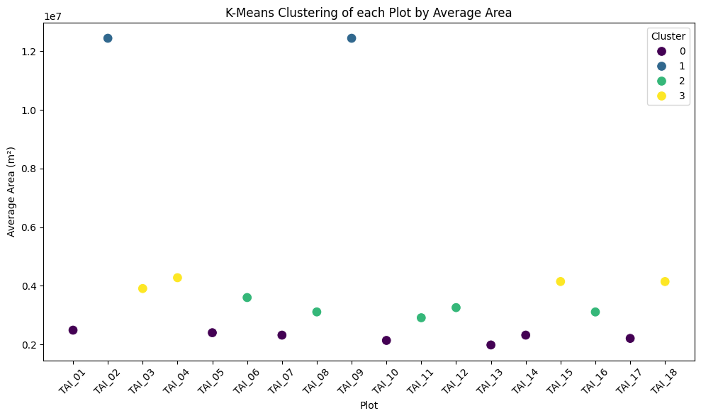
    


    
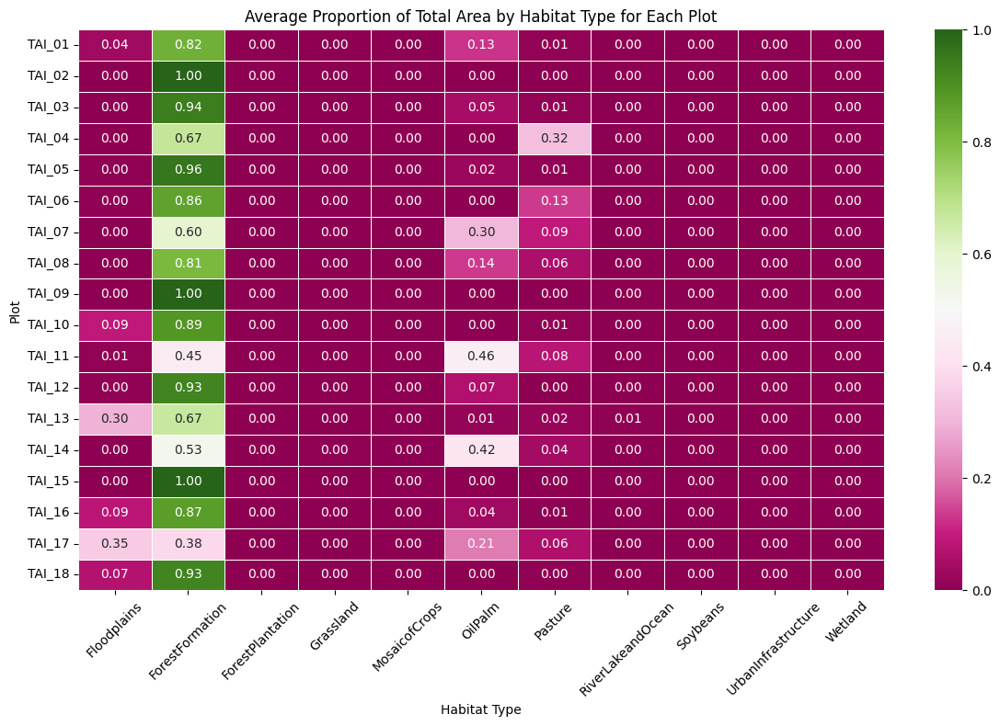
    


    
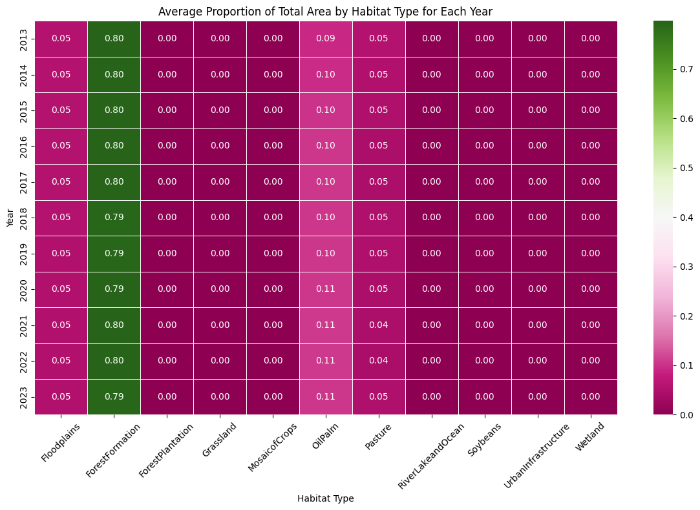
    


    ANOVA for BufferID:
    F-statistic: 9.00751058069251, p-value: 1.3372846720700188e-21
    
    Tukey HSD Test for PLot:
              Multiple Comparison of Means - Tukey HSD, FWER=0.05          
    =======================================================================
    group1 group2    meandiff    p-adj      lower          upper     reject
    -----------------------------------------------------------------------
    TAI_01 TAI_02   9952017.1729    0.0   5388010.0773 14516024.2686   True
    TAI_01 TAI_03   1419641.5462 0.9727  -1568202.4521  4407485.5445  False
    TAI_01 TAI_04   1787849.2717 0.8503  -1284392.0272  4860090.5705  False
    TAI_01 TAI_05    -87312.9164    1.0  -2699127.0593  2524501.2265  False
    TAI_01 TAI_06   1111634.6378 0.9975  -1803243.2233  4026512.4989  False
    TAI_01 TAI_07   -169888.1874    1.0  -2759872.3331  2420095.9582  False
    TAI_01 TAI_08    621840.5455    1.0  -2173031.5962  3416712.6871  False
    TAI_01 TAI_09   9951530.1225    0.0   5387523.0268 14515537.2181   True
    TAI_01 TAI_10   -350639.2941    1.0  -2891343.9267  2190065.3384  False
    TAI_01 TAI_11    423092.1702    1.0  -2321778.2219  3167962.5623  False
    TAI_01 TAI_12    769307.6807    1.0  -2062292.3456  3600907.7069  False
    TAI_01 TAI_13   -505275.0997    1.0  -3003071.1985   1992520.999  False
    TAI_01 TAI_14   -169099.8126    1.0  -2759083.9582  2420884.3331  False
    TAI_01 TAI_15   1658171.2941 0.9084   -1384500.103  4700842.6912  False
    TAI_01 TAI_16    620587.7647    1.0   -2174284.377  3415459.9064  False
    TAI_01 TAI_17   -281493.3359    1.0  -2841067.8185  2278081.1468  False
    TAI_01 TAI_18   1656872.4706  0.909  -1385798.9265  4699543.8677  False
    TAI_02 TAI_03  -8532375.6267    0.0  -13308774.438 -3755976.8155   True
    TAI_02 TAI_04  -8164167.9013    0.0 -12993809.7559 -3334526.0466   True
    TAI_02 TAI_05 -10039330.0893    0.0 -14589972.5674 -5488687.6113   True
    TAI_02 TAI_06  -8840382.5352    0.0 -13571480.3772 -4109284.6931   True
    TAI_02 TAI_07 -10121905.3604    0.0 -14660053.8507   -5583756.87   True
    TAI_02 TAI_08  -9330176.6275    0.0 -13988296.8636 -4672056.3914   True
    TAI_02 TAI_09      -487.0505    1.0  -5892594.8749  5891620.7739  False
    TAI_02 TAI_10 -10302656.4671    0.0 -14812861.9918 -5792450.9423   True
    TAI_02 TAI_11  -9528925.0027    0.0 -14157217.0544 -4900632.9511   True
    TAI_02 TAI_12  -9182709.4923    0.0 -13862958.6902 -4502460.2944   True
    TAI_02 TAI_13 -10457292.2727    0.0 -14943466.4999 -5971118.0455   True
    TAI_02 TAI_14 -10121116.9855    0.0 -14659265.4759 -5582968.4951   True
    TAI_02 TAI_15  -8293845.8788    0.0 -13104731.7719 -3482959.9857   True
    TAI_02 TAI_16  -9331429.4082    0.0 -13989549.6444 -4673309.1721   True
    TAI_02 TAI_17 -10233510.5088    0.0 -14754372.7471 -5712648.2705   True
    TAI_02 TAI_18  -8295144.7024    0.0 -13106030.5955 -3484258.8093   True
    TAI_03 TAI_04    368207.7255    1.0  -3011509.9304  3747925.3814  False
    TAI_03 TAI_05  -1506954.4626 0.9494  -4474343.5427  1460434.6174  False
    TAI_03 TAI_06   -308006.9084    1.0  -3545341.8896  2929328.0727  False
    TAI_03 TAI_07  -1589529.7337  0.916  -4537722.8599  1358663.3926  False
    TAI_03 TAI_08   -797801.0008    1.0  -3927519.0589  2331917.0574  False
    TAI_03 TAI_09   8531888.5762    0.0    3755489.765 13308287.3875   True
    TAI_03 TAI_10  -1770280.8403  0.796  -4675277.3748  1134715.6941  False
    TAI_03 TAI_11    -996549.376 0.9997  -4081697.3959  2088598.6439  False
    TAI_03 TAI_12   -650333.8655    1.0  -3812893.5162  2512225.7851  False
    TAI_03 TAI_13   -1924916.646 0.6462  -4792460.9239    942627.632  False
    TAI_03 TAI_14  -1588741.3588 0.9163  -4536934.4851  1359451.7675  False
    TAI_03 TAI_15    238529.7479    1.0  -3114330.8316  3591390.3274  False
    TAI_03 TAI_16   -799053.7815    1.0  -3928771.8396  2330664.2766  False
    TAI_03 TAI_17  -1701134.8821 0.8497  -4622649.2783  1220379.5141  False
    TAI_03 TAI_18    237230.9244    1.0  -3115629.6551  3590091.5039  False
    TAI_04 TAI_05  -1875162.1881 0.7853  -4927514.1981  1177189.8219  False
    TAI_04 TAI_06   -676214.6339    1.0  -3991601.8844  2639172.6166  False
    TAI_04 TAI_07  -1957737.4591 0.7127  -4991431.1731  1075956.2548  False
    TAI_04 TAI_08  -1166008.7262 0.9986  -4376396.5476  2044379.0952  False
    TAI_04 TAI_09   8163680.8508    0.0   3334038.9961 12993322.7054   True
    TAI_04 TAI_10  -2138488.5658 0.5293  -5130220.4564   853243.3248  False
    TAI_04 TAI_11  -1364757.1015 0.9899  -4531710.3921  1802196.1891  False
    TAI_04 TAI_12   -1018541.591 0.9998  -4260954.0238  2223870.8417  False
    TAI_04 TAI_13  -2293124.3714 0.3708  -5248503.3702   662254.6274  False
    TAI_04 TAI_14  -1956949.0843 0.7133  -4990642.7982  1076744.6297  False
    TAI_04 TAI_15   -129677.9776    1.0  -3557961.6452  3298605.6901  False
    TAI_04 TAI_16   -1167261.507 0.9986  -4377649.3284  2043126.3144  False
    TAI_04 TAI_17  -2069342.6076 0.6017   -5077116.071   938430.8559  False
    TAI_04 TAI_18   -130976.8011    1.0  -3559260.4688  3297306.8666  False
    TAI_05 TAI_06   1198947.5542 0.9935  -1694959.6903  4092854.7986  False
    TAI_05 TAI_07     -82575.271    1.0  -2648935.3527  2483784.8107  False
    TAI_05 TAI_08    709153.4619    1.0  -2063840.6749  3482147.5986  False
    TAI_05 TAI_09  10038843.0389    0.0   5488200.5608 14589485.5169   True
    TAI_05 TAI_10   -263326.3777    1.0  -2779944.3909  2253291.6355  False
    TAI_05 TAI_11    510405.0866    1.0  -2212185.5297  3232995.7029  False
    TAI_05 TAI_12    856620.5971 0.9999  -1953387.3928  3666628.5869  False
    TAI_05 TAI_13   -417962.1833    1.0  -2891253.8251  2055329.4585  False
    TAI_05 TAI_14    -81786.8962    1.0  -2648146.9779  2484573.1856  False
    TAI_05 TAI_15   1745484.2105 0.8582  -1277103.3275  4768071.7485  False
    TAI_05 TAI_16    707900.6811    1.0  -2065093.4557  3480894.8179  False
    TAI_05 TAI_17   -194180.4195    1.0  -2729847.5361  2341486.6972  False
    TAI_05 TAI_18    1744185.387  0.859   -1278402.151   4766772.925  False
    TAI_06 TAI_07  -1281522.8252 0.9856  -4155743.3973  1592697.7469  False
    TAI_06 TAI_08   -489794.0923    1.0  -3549930.7413  2570342.5567  False
    TAI_06 TAI_09   8839895.4847    0.0   4108797.6426 13570993.3267   True
    TAI_06 TAI_10  -1462273.9319 0.9411  -4292168.9922  1367621.1284  False
    TAI_06 TAI_11   -688542.4676    1.0  -3703080.4905  2325995.5554  False
    TAI_06 TAI_12   -342326.9571    1.0  -3436043.9336  2751390.0194  False
    TAI_06 TAI_13  -1616909.7375 0.8551  -4408345.0983  1174525.6232  False
    TAI_06 TAI_14  -1280734.4503 0.9857  -4154955.0224  1593486.1217  False
    TAI_06 TAI_15    546536.6563    1.0  -2741468.0962  3834541.4089  False
    TAI_06 TAI_16   -491046.8731    1.0  -3551183.5221  2569089.7759  False
    TAI_06 TAI_17  -1393127.9736 0.9639  -4239976.6795  1453720.7323  False
    TAI_06 TAI_18    545237.8328    1.0  -2742766.9197  3833242.5854  False
    TAI_07 TAI_08    791728.7329 0.9999   -1960714.044  3544171.5098  False
    TAI_07 TAI_09  10121418.3099    0.0   5583269.8195 14659566.8003   True
    TAI_07 TAI_10   -180751.1067    1.0  -2674705.9943   2313203.781  False
    TAI_07 TAI_11    592980.3577    1.0  -2108675.5089  3294636.2242  False
    TAI_07 TAI_12    939195.8681 0.9995  -1850533.4486  3728925.1848  False
    TAI_07 TAI_13   -335386.9123    1.0  -2785614.7186   2114840.894  False
    TAI_07 TAI_14       788.3749    1.0  -2543351.7208  2544928.4706  False
    TAI_07 TAI_15   1828059.4816 0.7977  -1175684.8788  4831803.8419  False
    TAI_07 TAI_16    790475.9521 0.9999  -1961966.8247   3542918.729  False
    TAI_07 TAI_17   -111605.1484    1.0   -2624780.925  2401570.6281  False
    TAI_07 TAI_18    1826760.658 0.7986  -1176983.7023  4830505.0184  False
    TAI_08 TAI_09    9329689.577    0.0   4671569.3409 13987809.8131   True
    TAI_08 TAI_10   -972479.8396 0.9988  -3678603.1544  1733643.4753  False
    TAI_08 TAI_11   -198748.3752    1.0  -3097409.5895   2699912.839  False
    TAI_08 TAI_12    147467.1352    1.0  -2833452.5339  3128386.8044  False
    TAI_08 TAI_13  -1127115.6452 0.9918  -3792994.2464   1538762.956  False
    TAI_08 TAI_14    -790940.358 0.9999  -3543383.1349  1961502.4189  False
    TAI_08 TAI_15   1036330.7487 0.9997  -2145771.1661  4218432.6634  False
    TAI_08 TAI_16     -1252.7807    1.0   -2947306.693  2944801.1315  False
    TAI_08 TAI_17   -903333.8813 0.9996  -3627181.3252  1820513.5626  False
    TAI_08 TAI_18   1035031.9251 0.9997  -2147069.9896  4217133.8399  False
    TAI_09 TAI_10 -10302169.4166    0.0 -14812374.9414 -5791963.8918   True
    TAI_09 TAI_11  -9528437.9522    0.0 -14156730.0039 -4900145.9006   True
    TAI_09 TAI_12  -9182222.4418    0.0 -13862471.6397 -4501973.2439   True
    TAI_09 TAI_13 -10456805.2222    0.0 -14942979.4494  -5970630.995   True
    TAI_09 TAI_14  -10120629.935    0.0 -14658778.4254 -5582481.4447   True
    TAI_09 TAI_15  -8293358.8283    0.0 -13104244.7214 -3482472.9352   True
    TAI_09 TAI_16  -9330942.3578    0.0 -13989062.5939 -4672822.1216   True
    TAI_09 TAI_17 -10233023.4583    0.0 -14753885.6967   -5712161.22   True
    TAI_09 TAI_18  -8294657.6519    0.0  -13105543.545 -3483771.7588   True
    TAI_10 TAI_11    773731.4643 0.9999  -1880718.8698  3428181.7985  False
    TAI_10 TAI_12   1119946.9748 0.9945  -1624092.3499  3863986.2995  False
    TAI_10 TAI_13   -154635.8056    1.0  -2552713.8815  2243442.2703  False
    TAI_10 TAI_14    181539.4816    1.0  -2312415.4061  2675494.3692  False
    TAI_10 TAI_15   2008810.5882 0.6275   -952547.6031  4970168.7796  False
    TAI_10 TAI_16    971227.0588 0.9988   -1734896.256  3677350.3737  False
    TAI_10 TAI_17     69145.9583    1.0  -2393213.6091  2531505.5256  False
    TAI_10 TAI_18   2007511.7647 0.6287   -953846.4267  4968869.9561  False
    TAI_11 TAI_12    346215.5105    1.0  -2587874.6816  3280305.7025  False
    TAI_11 TAI_13     -928367.27 0.9989  -3541777.2833  1685042.7434  False
    TAI_11 TAI_14   -592191.9828    1.0  -3293847.8493  2109463.8838  False
    TAI_11 TAI_15   1235079.1239 0.9964  -1903196.8004  4373355.0482  False
    TAI_11 TAI_16    197495.5945    1.0  -2701165.6197  3096156.8087  False
    TAI_11 TAI_17   -704585.5061    1.0  -3377102.6863  1967931.6742  False
    TAI_11 TAI_18   1233780.3004 0.9964   -1904495.624  4372056.2247  False
    TAI_12 TAI_13  -1274582.7804 0.9748  -3978941.6946  1429776.1338  False
    TAI_12 TAI_14   -938407.4932 0.9995  -3728136.8099  1851321.8235  False
    TAI_12 TAI_15    888863.6134    1.0  -2325544.7328  4103271.9597  False
    TAI_12 TAI_16    -148719.916    1.0  -3129639.5851  2832199.7532  False
    TAI_12 TAI_17  -1050801.0165 0.9976  -3812321.1265  1710719.0934  False
    TAI_12 TAI_18    887564.7899    1.0  -2326843.5563  4101973.1361  False
    TAI_13 TAI_14    336175.2872    1.0  -2114052.5191  2786403.0935  False
    TAI_13 TAI_15   2163446.3939 0.4627   -761181.3874  5088074.1751  False
    TAI_13 TAI_16   1125862.8645 0.9919  -1540015.7368  3791741.4657  False
    TAI_13 TAI_17    223781.7639    1.0  -2194279.4347  2641842.9625  False
    TAI_13 TAI_18   2162147.5703 0.4638   -762480.2109  5086775.3516  False
    TAI_14 TAI_15   1827271.1067 0.7982  -1176473.2537   4831015.467  False
    TAI_14 TAI_16    789687.5773 0.9999  -1962755.1996  3542130.3542  False
    TAI_14 TAI_17   -112393.5233    1.0  -2625569.2999  2400782.2533  False
    TAI_14 TAI_18   1825972.2832 0.7992  -1177772.0772  4829716.6435  False
    TAI_15 TAI_16  -1037583.5294 0.9997  -4219685.4442  2144518.3854  False
    TAI_15 TAI_17    -1939664.63 0.6974  -4917228.0365  1037898.7765  False
    TAI_15 TAI_18     -1298.8235    1.0  -3403108.8621   3400511.215  False
    TAI_16 TAI_17   -902081.1006 0.9996  -3625928.5444  1821766.3433  False
    TAI_16 TAI_18   1036284.7059 0.9997  -2145817.2089  4218386.6206  False
    TAI_17 TAI_18   1938365.8065 0.6985  -1039197.6001   4915929.213  False
    -----------------------------------------------------------------------
    


    
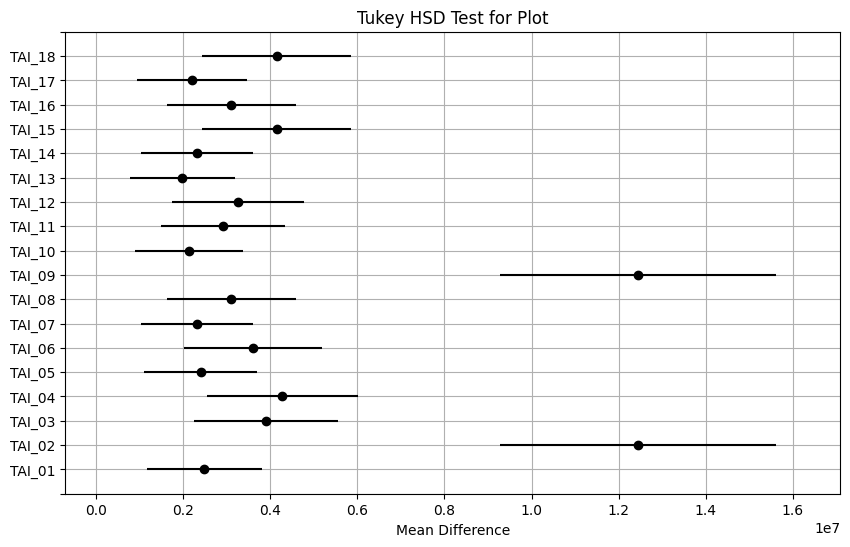
    


    ANOVA for Type:
    F-statistic: 464.7582383256251, p-value: 1.64e-321
    
    Tukey HSD Test for Type:
                          Multiple Comparison of Means - Tukey HSD, FWER=0.05                       
    ================================================================================================
           group1              group2          meandiff   p-adj      lower          upper     reject
    ------------------------------------------------------------------------------------------------
            Floodplains     ForestFormation  8977324.9034    0.0   8398617.0403  9556032.7665   True
            Floodplains    ForestPlantation  -901621.7277 0.1387  -1920011.7905   116768.3351  False
            Floodplains           Grassland  -888500.2429 0.1412  -1894648.4639    117647.978  False
            Floodplains       MosaicofCrops  -898134.2805 0.4686  -2185777.3532   389508.7923  False
            Floodplains             OilPalm   910244.7248 0.0002    282140.1697    1538349.28   True
            Floodplains             Pasture  -240545.7901  0.968   -835755.2101     354663.63  False
            Floodplains   RiverLakeandOcean  -865295.8052 0.3669  -2028530.6518   297939.0413  False
            Floodplains            Soybeans   -908085.364 0.9971  -3984398.8511   2168228.123  False
            Floodplains UrbanInfrastructure  -907238.3052 0.7947   -2557218.787   742742.1765  False
            Floodplains             Wetland  -888098.9281 0.5638  -2240951.0265   464753.1703  False
        ForestFormation    ForestPlantation -9878946.6311    0.0 -10870461.5028 -8887431.7593   True
        ForestFormation           Grassland -9865825.1463    0.0 -10844762.1532 -8886888.1395   True
        ForestFormation       MosaicofCrops -9875459.1838    0.0  -11141953.599 -8608964.7687   True
        ForestFormation             OilPalm -8067080.1786    0.0  -8650602.8885 -7483557.4686   True
        ForestFormation             Pasture -9217870.6935    0.0  -9765828.4241 -8669912.9628   True
        ForestFormation   RiverLakeandOcean -9842620.7086    0.0 -10982400.8317 -8702840.5855   True
        ForestFormation            Soybeans -9885410.2674    0.0 -12952931.7574 -6817888.7775   True
        ForestFormation UrbanInfrastructure -9884563.2086    0.0  -11518092.826 -8251033.5912   True
        ForestFormation             Wetland -9865423.8315    0.0 -11198162.4483 -8532685.2146   True
       ForestPlantation           Grassland    13121.4847    1.0  -1275495.2902  1301738.2597  False
       ForestPlantation       MosaicofCrops     3487.4472    1.0  -1515138.1264  1522113.0208  False
       ForestPlantation             OilPalm  1811866.4525    0.0    790732.6306  2833000.2744   True
       ForestPlantation             Pasture   661075.9376 0.5549   -340159.9006  1662311.7759  False
       ForestPlantation   RiverLakeandOcean    36325.9225    1.0  -1378352.2241   1451004.069  False
       ForestPlantation            Soybeans    -6463.6364    1.0  -3186385.5883  3173458.3156  False
       ForestPlantation UrbanInfrastructure    -5616.5775    1.0  -1841545.3725  1830312.2174  False
       ForestPlantation             Wetland    13522.7996    1.0  -1560773.1542  1587818.7534  False
              Grassland       MosaicofCrops    -9634.0375    1.0  -1520077.5337  1500809.4587  False
              Grassland             OilPalm  1798744.9678    0.0    789819.6956  2807670.2399   True
              Grassland             Pasture   647954.4529 0.5665   -340827.1844  1636736.0902  False
              Grassland   RiverLakeandOcean    23204.4377    1.0   -1382686.803  1429095.6784  False
              Grassland            Soybeans   -19585.1211    1.0  -3195607.7191  3156437.4769  False
              Grassland UrbanInfrastructure   -18738.0623    1.0  -1847904.6656   1810428.541  False
              Grassland             Wetland      401.3149    1.0  -1566003.3814  1566806.0112  False
          MosaicofCrops             OilPalm  1808379.0053 0.0004    518564.8152  3098193.1953   True
          MosaicofCrops             Pasture   657588.4904 0.8524   -616530.6431  1931707.6239  False
          MosaicofCrops   RiverLakeandOcean    32838.4752    1.0  -1586488.7372  1652165.6877  False
          MosaicofCrops            Soybeans    -9951.0836    1.0   -3286047.844  3266145.6768  False
          MosaicofCrops UrbanInfrastructure    -9104.0248    1.0  -2006988.1312  1988780.0817  False
          MosaicofCrops             Wetland    10035.3524    1.0  -1750451.5441  1770522.2489  False
                OilPalm             Pasture -1150790.5149    0.0  -1750682.3517  -550898.6781   True
                OilPalm   RiverLakeandOcean   -1775540.53 0.0001  -2941178.2398  -609902.8203   True
                OilPalm            Soybeans -1818330.0889 0.7123  -4895552.9656  1258892.7878  False
                OilPalm UrbanInfrastructure   -1817483.03 0.0176  -3469158.4075  -165807.6526   True
                OilPalm             Wetland -1798343.6529  0.001  -3153262.3819  -443424.9239   True
                Pasture   RiverLakeandOcean  -624750.0152 0.8052  -1772996.5879   523496.5576  False
                Pasture            Soybeans   -667539.574 0.9998  -3738216.9511  2403137.8031  False
                Pasture UrbanInfrastructure  -666692.5152 0.9666  -2306140.7375   972755.7072  False
                Pasture             Wetland   -647553.138 0.8984  -1987539.5871   692433.3111  False
      RiverLakeandOcean            Soybeans   -42789.5588    1.0  -3272015.5665  3186436.4489  False
      RiverLakeandOcean UrbanInfrastructure      -41942.5    1.0  -1962002.7929  1878117.7929  False
      RiverLakeandOcean             Wetland   -22803.1228    1.0  -1694450.4356  1648844.1899  False
               Soybeans UrbanInfrastructure      847.0588    1.0  -3433861.2098  3435555.3275  False
               Soybeans             Wetland     19986.436    1.0   -3282284.616   3322257.488  False
    UrbanInfrastructure             Wetland    19139.3772    1.0  -2021381.3947   2059660.149  False
    ------------------------------------------------------------------------------------------------
    


    
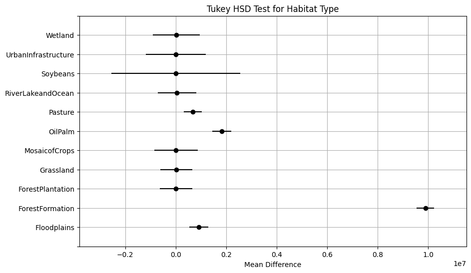
    


    
    ANOVA for Year:
    F-statistic: 0.04438257860079598, p-value: 0.9999961834517294
    
    Tukey HSD Test for Year:
           Multiple Comparison of Means - Tukey HSD, FWER=0.05        
    ==================================================================
    group1 group2   meandiff   p-adj     lower        upper     reject
    ------------------------------------------------------------------
      2013   2014  -43796.5437   1.0 -2364596.2714  2277003.184  False
      2013   2015   45047.8736   1.0 -2292155.1025 2382250.8497  False
      2013   2016          0.0   1.0 -2328900.2749  2328900.275  False
      2013   2017  -86393.1822   1.0   -2399287.08 2226500.7157  False
      2013   2018  -168178.728   1.0 -2465817.1789 2129459.7229  False
      2013   2019  -245231.778   1.0 -2528313.1439  2037849.588  False
      2013   2020  -86393.1822   1.0   -2399287.08 2226500.7157  False
      2013   2021 -127838.5601   1.0 -2433014.2748 2177337.1545  False
      2013   2022       0.0001   1.0 -2328900.2749  2328900.275  False
      2013   2023  139118.4332   1.0   -2215328.13 2493564.9965  False
      2014   2015   88844.4173   1.0 -2240286.8879 2417975.7225  False
      2014   2016   43796.5437   1.0  -2277003.184 2364596.2715  False
      2014   2017  -42596.6384   1.0 -2347333.7315 2262140.4546  False
      2014   2018 -124382.1843   1.0 -2413809.4787 2165045.1101  False
      2014   2019 -201435.2342   1.0 -2476252.8992 2073382.4308  False
      2014   2020  -42596.6384   1.0 -2347333.7315 2262140.4546  False
      2014   2021  -84042.0164   1.0 -2381033.5185 2212949.4857  False
      2014   2022   43796.5438   1.0 -2277003.1839 2364596.2715  False
      2014   2023   182914.977   1.0 -2163519.2336 2529349.1876  False
      2015   2016  -45047.8736   1.0 -2382250.8497 2292155.1025  False
      2015   2017 -131441.0558   1.0 -2452694.9073 2189812.7958  False
      2015   2018 -213226.6016   1.0 -2519280.3112  2092827.108  False
      2015   2019 -290279.6516   1.0 -2581829.7349 2001270.4317  False
      2015   2020 -131441.0558   1.0 -2452694.9073 2189812.7958  False
      2015   2021 -172886.4337   1.0 -2486449.9915 2140677.1241  False
      2015   2022  -45047.8735   1.0 -2382250.8496 2292155.1025  False
      2015   2023   94070.5596   1.0 -2268588.9334 2456730.0526  False
      2016   2017  -86393.1822   1.0   -2399287.08 2226500.7157  False
      2016   2018  -168178.728   1.0 -2465817.1789 2129459.7229  False
      2016   2019  -245231.778   1.0 -2528313.1439  2037849.588  False
      2016   2020  -86393.1822   1.0   -2399287.08 2226500.7157  False
      2016   2021 -127838.5601   1.0 -2433014.2748 2177337.1545  False
      2016   2022       0.0001   1.0 -2328900.2749  2328900.275  False
      2016   2023  139118.4332   1.0   -2215328.13 2493564.9965  False
      2017   2018  -81785.5459   1.0 -2363198.2974 2199627.2057  False
      2017   2019 -158838.5958   1.0 -2425590.0633 2107912.8717  False
      2017   2020          0.0   1.0 -2296775.9739 2296775.9739  False
      2017   2021   -41445.378   1.0 -2330448.8221 2247558.0662  False
      2017   2022   86393.1822   1.0 -2226500.7156 2399287.0801  False
      2017   2023  225511.6154   1.0 -2113103.4258 2564126.6566  False
      2018   2019    -77053.05   1.0 -2328236.4018 2174130.3019  False
      2018   2020   81785.5459   1.0 -2199627.2057 2363198.2974  False
      2018   2021   40340.1679   1.0 -2233247.5334 2313927.8692  False
      2018   2022  168178.7281   1.0 -2129459.7228  2465817.179  False
      2018   2023  307297.1612   1.0 -2016231.3149 2630825.6374  False
      2019   2020  158838.5958   1.0 -2107912.8717 2425590.0633  False
      2019   2021  117393.2178   1.0 -2141482.4113  2376268.847  False
      2019   2022   245231.778   1.0 -2037849.5879  2528313.144  False
      2019   2023  384350.2112   1.0 -1924784.3999 2693484.8223  False
      2020   2021   -41445.378   1.0 -2330448.8221 2247558.0662  False
      2020   2022   86393.1822   1.0 -2226500.7156 2399287.0801  False
      2020   2023  225511.6154   1.0 -2113103.4258 2564126.6566  False
      2021   2022  127838.5602   1.0 -2177337.1544 2433014.2748  False
      2021   2023  266956.9934   1.0 -2064025.0323  2597939.019  False
      2022   2023  139118.4332   1.0 -2215328.1301 2493564.9964  False
    ------------------------------------------------------------------
    


    
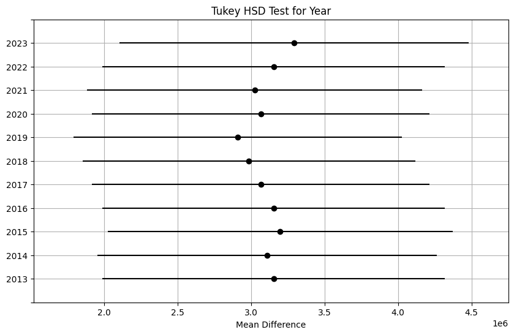
    


    C:\Users\vs24904\AppData\Local\anaconda32\Lib\site-packages\statsmodels\tsa\base\tsa_model.py:473: ValueWarning: An unsupported index was provided. As a result, forecasts cannot be generated. To use the model for forecasting, use one of the supported classes of index.
      self._init_dates(dates, freq)
    C:\Users\vs24904\AppData\Local\anaconda32\Lib\site-packages\statsmodels\tsa\base\tsa_model.py:473: ValueWarning: An unsupported index was provided. As a result, forecasts cannot be generated. To use the model for forecasting, use one of the supported classes of index.
      self._init_dates(dates, freq)
    C:\Users\vs24904\AppData\Local\anaconda32\Lib\site-packages\statsmodels\tsa\base\tsa_model.py:473: ValueWarning: An unsupported index was provided. As a result, forecasts cannot be generated. To use the model for forecasting, use one of the supported classes of index.
      self._init_dates(dates, freq)
    C:\Users\vs24904\AppData\Local\anaconda32\Lib\site-packages\statsmodels\tsa\base\tsa_model.py:837: ValueWarning: No supported index is available. Prediction results will be given with an integer index beginning at `start`.
      return get_prediction_index(
    C:\Users\vs24904\AppData\Local\anaconda32\Lib\site-packages\statsmodels\tsa\base\tsa_model.py:837: FutureWarning: No supported index is available. In the next version, calling this method in a model without a supported index will result in an exception.
      return get_prediction_index(
    


    
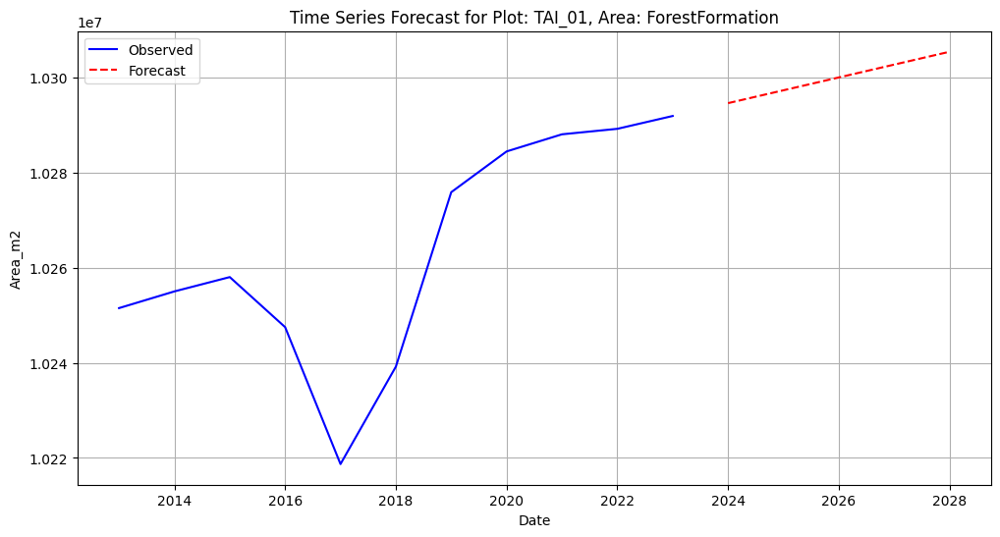
    


        Date  Forecasted_Area_m2
    11  2024        1.029459e+07
    12  2025        1.029729e+07
    13  2026        1.029999e+07
    14  2027        1.030269e+07
    15  2028        1.030539e+07
    MAE: 22952.759128947928
    MSE: 786893609.4934272
    RMSE: 28051.624008128783
    MAPE: nan%
    

    C:\Users\vs24904\AppData\Local\anaconda32\Lib\site-packages\statsmodels\tsa\base\tsa_model.py:473: ValueWarning: An unsupported index was provided. As a result, forecasts cannot be generated. To use the model for forecasting, use one of the supported classes of index.
      self._init_dates(dates, freq)
    C:\Users\vs24904\AppData\Local\anaconda32\Lib\site-packages\statsmodels\tsa\base\tsa_model.py:473: ValueWarning: An unsupported index was provided. As a result, forecasts cannot be generated. To use the model for forecasting, use one of the supported classes of index.
      self._init_dates(dates, freq)
    C:\Users\vs24904\AppData\Local\anaconda32\Lib\site-packages\statsmodels\tsa\base\tsa_model.py:473: ValueWarning: An unsupported index was provided. As a result, forecasts cannot be generated. To use the model for forecasting, use one of the supported classes of index.
      self._init_dates(dates, freq)
    C:\Users\vs24904\AppData\Local\anaconda32\Lib\site-packages\statsmodels\tsa\statespace\sarimax.py:966: UserWarning: Non-stationary starting autoregressive parameters found. Using zeros as starting parameters.
      warn('Non-stationary starting autoregressive parameters'
    C:\Users\vs24904\AppData\Local\anaconda32\Lib\site-packages\statsmodels\tsa\base\tsa_model.py:837: ValueWarning: No supported index is available. Prediction results will be given with an integer index beginning at `start`.
      return get_prediction_index(
    C:\Users\vs24904\AppData\Local\anaconda32\Lib\site-packages\statsmodels\tsa\base\tsa_model.py:837: FutureWarning: No supported index is available. In the next version, calling this method in a model without a supported index will result in an exception.
      return get_prediction_index(
    


    
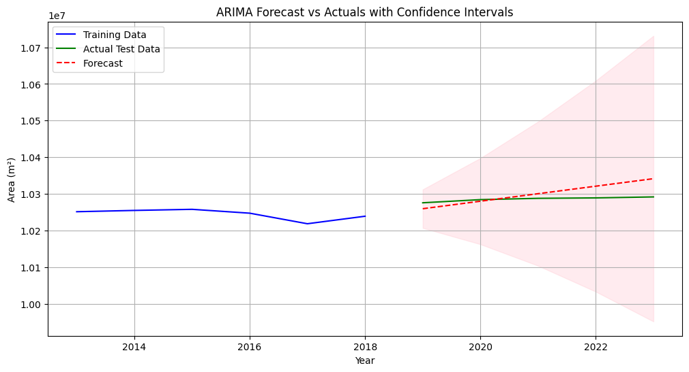
    


```python
#########################################################################################################################################################
##############################                                SECOND DATA BASE               ####################################

# I used a second data base to explore a bigger area than contains all 18 plots plus the area between the plots. An area of 30,000 m2 radius.
# I found important to also analize this data base, because it can contain information thta is important to undertand the main land use differences
# in the whole area and not only snips of it 

center = pd.read_excel(r"C:\Users\vs24904\OneDrive - University of Bristol\Documents\centerb.xlsx")

##############################               First, I am going to use some clustering to explore the data            ##################################

# Group by BufferID and calculate the average area
center_avg_area = center.groupby('Type')['Area_m2'].mean().reset_index()
# Standardize the data
scaler = StandardScaler()
center_avg_area_scaled = scaler.fit_transform(center_avg_area[['Area_m2']])

# Apply K-Means clustering
kmeans = KMeans(n_clusters=4, random_state=0)
center_avg_area['Cluster'] = kmeans.fit_predict(center_avg_area_scaled)

# Plot the clusters
# Here the cluster plot indicates which habitat type has more area in total, in the big area that encompas the 18 plots.
# We can see that in the big area "ForestFormation" has the biggest squared meter area, followed by "Pasture" and "OilPalm"

plt.figure(figsize=(10, 6))
sns.scatterplot(x='Type', y='Area_m2', hue='Cluster', data=center_avg_area, palette='viridis', s=100)
plt.title('K-Means Clustering of Habitat Type by Average Area m2')
plt.xlabel('Type')
plt.ylabel('Average Area (m²)')
plt.legend(title='Cluster')
plt.xticks(rotation=90)
plt.tight_layout()
plt.savefig('K-Means Clustering of Habitat Type by Average Area m2 center.png')
plt.show()

#########   HEAT MAP FOR HABITAT TYPE PER YEAR

# Aggregate by BufferID and Areas to calculate the average proportion across all years
center_avg_proportion = center.groupby(['Date', 'Type'])['Area_m2'].sum().reset_index()
# Calculate the proportion of Area_m2 for each Area within each Plot
center_avg_proportion['Proportion'] = center_avg_proportion.groupby('Date')['Area_m2'].transform(lambda x: x / x.sum())
# Pivot the data for heatmap
center_pivot_avg = center_avg_proportion.pivot_table(values='Proportion', index='Date', columns='Type', fill_value=0)

#Plot the heatmap
#In the heatmap we can see that our main habitat type is "Forest formation" all Years, followed by "OilPalm".
#The percentages dont really change across the years.
plt.figure(figsize=(12, 8))
sns.heatmap(center_pivot_avg, cmap='PiYG', annot=True, fmt='.2f', linewidths=0.5)
plt.title('Average Proportion of Total Area by Habitat Type for Each Year')
plt.xlabel('Habitat Type')
plt.ylabel('Year')
plt.xticks(rotation=80)
plt.tight_layout()
plt.savefig('Average Proportion of Total Area by Habitat Type for Each Year.png')
plt.show()

##############################              ARE THE DIFFERENCES IN THE HEAT MAPS SIGNIFICANT                                ####################


#################       ANOVA for Type

Type_cent_groups = [center[center['Type'] == Type]['Area_m2'].values for Type in center['Type'].unique()]
anova_cent_Type = f_oneway(*Type_cent_groups)
print("ANOVA for Type:")
print(f"F-statistic: {anova_cent_Type.statistic}, p-value: {anova_cent_Type.pvalue}")

# Perform Tukey's HSD test for Type
tukey_type = pairwise_tukeyhsd(endog=center['Area_m2'], groups=center['Type'], alpha=0.05)
# Display the results
print("\nTukey HSD Test for PLot:")
print(tukey_type)
# Visualize the Tukey HSD results
tukey_type.plot_simultaneous()
plt.title("Tukey HSD Test for Habitat Type")
plt.xlabel('Mean Difference')
plt.grid(True)
plt.savefig('Tukey HSD Test for Type center.png')
plt.show()
#There is a significant difference between the Habitat types, being ForestFormation, Pastures, OilPalm, and Floodplains the ones that produce this difference.
#These types are the one with the largest area_m2
# A difference can be noted between the whole area of the experiment and the selected plot. 
# If only we take only the plots under accountance we get a false overview of the area, beacause the plots were selected to get a gradient of type of forest
# But ForestFormation has by far the largest area. If we take also the whole area encompasing the plots, we can see that the area is actually pretty
# heterogenic, having a high area disturbance type habitats, like Pasture and Oilpalm

######################################################################################
#################      ANOVA for Year
year_groups = [center[center['Date'] == year]['Area_m2'].values for year in center['Date'].unique()]
anova_year = f_oneway(*year_groups)
print("\nANOVA for Year:")
print(f"F-statistic: {anova_year.statistic}, p-value: {anova_year.pvalue}")

# Perform Tukey's HSD test for Year
tukey_Year = pairwise_tukeyhsd(endog=center['Area_m2'], groups=center['Date'], alpha=0.05)
# Display the results
print("\nTukey HSD Test for Year:")
print(tukey_Year)
# Visualize the Tukey HSD results
tukey_Year.plot_simultaneous()
plt.title("Tukey HSD Test for Year")
plt.xlabel('Mean Difference')
plt.grid(True)
plt.savefig('Tukey HSD Test for Year center.png')
plt.show()
#There was no a significant in the area differences between the 11 years

#######################################################################################################################################################
#############################################################################################################
#####                                                    TIME SERIES AND FORECASTING

####    PASTURES
# Load the dataset
df = pd.read_excel(r"C:\Users\vs24904\OneDrive - University of Bristol\Documents\centerb.xlsx")

# Identify unique BufferIDs and Area
unique_dates = df['Date'].unique()
unique_buffer_ids = df['BufferID'].unique()
unique_areas = df['Type'].unique()

# Create a complete DataFrame with all combinations
all_combinations = pd.DataFrame(
    list(itertools.product(unique_dates, unique_buffer_ids, unique_areas)),
    columns=['Date', 'BufferID', 'Type'])
# Step 3: Merge with the original DataFrame and fill missing values with 0
df_complete = pd.merge(all_combinations, df, on=['Date', 'BufferID', 'Type'], how='left').fillna({'Area_m2': 0})

# Time series analysis for a specific BufferID
area = 'Pasture'# Example Area
df_filtered = df[(df['Type'] == area)].copy()

# Convert Date to numeric index for time series modeling
df_filtered['Date'] = pd.to_numeric(df_filtered['Date'])
df_filtered.sort_values('Date', inplace=True)
df_filtered.set_index('Date', inplace=True)

# Define the model with specified order (p, d, q)
model = ARIMA(df_filtered['Area_m2'], order=(1, 2, 1))
# Fit the model
model_fit = model.fit()
#print(model_fit.summary())

#Forecast
steps = 5
forecast = model_fit.forecast(steps=steps)
forecast_years = range(df_filtered.index[-1] + 1, df_filtered.index[-1] + 1 + steps)
forecast_df = pd.DataFrame({'Date': forecast_years, 'Forecasted_Area_m2': forecast})

#Plot and forecast
plt.figure(figsize=(12, 6))
plt.plot(df_filtered.index, df_filtered['Area_m2'], label='Observed', color='blue')
plt.plot(forecast_df['Date'], forecast_df['Forecasted_Area_m2'], label='Forecast', color='red', linestyle='--')
plt.xlabel('Date')
plt.ylabel('Area (m2)')
plt.title(f'Time Series Forecast for Area: {area} in the Tailandia(Pará, Brazil)')
plt.legend()
plt.grid(True)
plt.savefig('time series forecast pasture tailandia.png')
plt.show()

print(forecast_df)

# The area m2 of Pasture habitat type in the site (Tailandia-Brazil), are expected to grow in the next 5 years
#I Checked the forecast using "ARIMA" and the forecast looks plausible


#####################################################################################################################################

#####                                                   test if forecast is correct or good


# Split data into training and testing sets (e.g., last 5 years for testing)
train_size = int(len(df_filtered) * 0.6)
train_data, test_data = df_filtered.iloc[:train_size], df_filtered.iloc[train_size:]

# Fit ARIMA model on the training data
arima_model_train = ARIMA(train_data['Area_m2'], order=(1, 2, 1))
arima_fit_train = arima_model_train.fit()

# Forecast for the test period
forecast_test = arima_fit_train.get_forecast(steps=len(test_data))
forecasted_values = forecast_test.predicted_mean
confidence_intervals = forecast_test.conf_int()

# Evaluation metrics
mae = mean_absolute_error(test_data['Area_m2'], forecasted_values)
mse = mean_squared_error(test_data['Area_m2'], forecasted_values)
rmse = np.sqrt(mse)
mape = np.mean(np.abs((test_data['Area_m2'] - forecasted_values) / test_data['Area_m2'])) * 100

# Print evaluation metrics
print(f"MAE: {mae}")
print(f"MSE: {mse}")
print(f"RMSE: {rmse}")
print(f"MAPE: {mape}%")

# Plot the forecast with confidence intervals
plt.figure(figsize=(12, 6))
plt.plot(train_data.index, train_data['Area_m2'], label='Training Data', color='blue')
plt.plot(test_data.index, test_data['Area_m2'], label='Actual Test Data', color='green')
plt.plot(test_data.index, forecasted_values, label='Forecast', color='red', linestyle='--')
plt.fill_between(test_data.index, confidence_intervals.iloc[:, 0], confidence_intervals.iloc[:, 1], color='pink', alpha=0.3)
plt.xlabel('Year')
plt.ylabel('Area (m²)')
plt.title('ARIMA Pastures Forecast vs Actuals with Confidence Intervals')
plt.legend()
plt.grid(True)
plt.savefig('ARIMA Pastures Forecast vs Actuals with Confidence Intervals.png')
plt.show()


##############################################################################################################

####    ForestFormation

# Load the dataset
df = pd.read_excel(r"C:\Users\vs24904\OneDrive - University of Bristol\Documents\centerb.xlsx")
print(df)

# Step 1: Identify unique BufferIDs and Area
unique_dates = df['Date'].unique()
unique_buffer_ids = df['BufferID'].unique()
unique_areas = df['Type'].unique()

# Step 2: Create a complete DataFrame with all combinations
import itertools
all_combinations = pd.DataFrame(
    list(itertools.product(unique_dates, unique_buffer_ids, unique_areas)),
    columns=['Date', 'BufferID', 'Type'])
# Step 3: Merge with the original DataFrame and fill missing values with 0
df_complete = pd.merge(all_combinations, df, on=['Date', 'BufferID', 'Type'], how='left').fillna({'Area_m2': 0})

# Time series analysis for a specific BufferID
area = 'ForestFormation'# Example Area
df_filtered = df[(df['Type'] == area)].copy()

# Convert Date to numeric index for time series modeling
df_filtered['Date'] = pd.to_numeric(df_filtered['Date'])
df_filtered.sort_values('Date', inplace=True)
df_filtered.set_index('Date', inplace=True)

# Define the model with specified order (p, d, q)
model = ARIMA(df_filtered['Area_m2'], order=(1, 2, 1))
# Fit the model
model_fit = model.fit()
#print(model_fit.summary())

#Forecast
steps = 5
forecast = model_fit.forecast(steps=steps)
forecast_years = range(df_filtered.index[-1] + 1, df_filtered.index[-1] + 1 + steps)
forecast_df = pd.DataFrame({'Date': forecast_years, 'Forecasted_Area_m2': forecast})

#Plot and forecast
plt.figure(figsize=(12, 6))
plt.plot(df_filtered.index, df_filtered['Area_m2'], label='Observed', color='blue')
plt.plot(forecast_df['Date'], forecast_df['Forecasted_Area_m2'], label='Forecast', color='red', linestyle='--')
plt.xlabel('Date')
plt.ylabel('Area (m2)')
plt.title(f'Time Series Forecast for Area: {area} in the Tailandia(Pará, Brazil)')
plt.legend()
plt.grid(True)
plt.savefig('Forest formation Forecast tailandia.png')
plt.show()

print(forecast_df)

# The area m2 of ForestFormation habitat type in the site (Tailandia-Brazil), is expected to decrease in the next 5 years
#I Checked the forecast using "ARIMA" and the forecast looks plausible, beacuse is inside the confidence intervals

#####################################################################################################################################

#####                                                   test if forecast is correct or good

# Split data into training and testing sets (e.g., last 5 years for testing)
train_size = int(len(df_filtered) * 0.5)
train_data, test_data = df_filtered.iloc[:train_size], df_filtered.iloc[train_size:]

# Fit SARIMA model on the training data
arima_model_train = ARIMA(train_data['Area_m2'], order=(1, 2, 1))
arima_fit_train = arima_model_train.fit()

# Forecast for the test period
forecast_test = arima_fit_train.get_forecast(steps=len(test_data))
forecasted_values = forecast_test.predicted_mean
confidence_intervals = forecast_test.conf_int()

# Evaluation metrics
mae = mean_absolute_error(test_data['Area_m2'], forecasted_values)
mse = mean_squared_error(test_data['Area_m2'], forecasted_values)
rmse = np.sqrt(mse)
mape = np.mean(np.abs((test_data['Area_m2'] - forecasted_values) / test_data['Area_m2'])) * 100

# Print evaluation metrics
print(f"MAE: {mae}")
print(f"MSE: {mse}")
print(f"RMSE: {rmse}")
print(f"MAPE: {mape}%")

# Plot the forecast with confidence intervals
plt.figure(figsize=(12, 6))
plt.plot(train_data.index, train_data['Area_m2'], label='Training Data', color='blue')
plt.plot(test_data.index, test_data['Area_m2'], label='Actual Test Data', color='green')
plt.plot(test_data.index, forecasted_values, label='Forecast', color='red', linestyle='--')
plt.fill_between(test_data.index, confidence_intervals.iloc[:, 0], confidence_intervals.iloc[:, 1], color='pink', alpha=0.3)
plt.xlabel('Year')
plt.ylabel('Area (m²)')
plt.title('ARIMA ForestFormation Forecast vs Actuals with Confidence Intervals')
plt.legend()
plt.grid(True)
plt.savefig('ARIMA ForestFormation Forecast vs Actuals with Confidence Intervals center.png')
plt.show()


##############################################################################################################

####    OilPalm

# Load the dataset
df = pd.read_excel(r"C:\Users\vs24904\OneDrive - University of Bristol\Documents\centerb.xlsx")
print(df)

# Identify unique BufferIDs and Area
unique_dates = df['Date'].unique()
unique_buffer_ids = df['BufferID'].unique()
unique_areas = df['Type'].unique()

# Create a complete DataFrame with all combinations
import itertools
all_combinations = pd.DataFrame(
    list(itertools.product(unique_dates, unique_buffer_ids, unique_areas)),
    columns=['Date', 'BufferID', 'Type'])
# Merge with the original DataFrame and fill missing values with 0
df_complete = pd.merge(all_combinations, df, on=['Date', 'BufferID', 'Type'], how='left').fillna({'Area_m2': 0})

# Time series analysis for a specific BufferID
area = 'OilPalm'# Example Area
df_filtered = df[(df['Type'] == area)].copy()

# Convert Date to numeric index for time series modeling
df_filtered['Date'] = pd.to_numeric(df_filtered['Date'])
df_filtered.sort_values('Date', inplace=True)
df_filtered.set_index('Date', inplace=True)

# Define the model with specified order (p, d, q)
model = ARIMA(df_filtered['Area_m2'], order=(1, 2, 1))
# Fit the model
model_fit = model.fit()
#print(model_fit.summary())

#Forecast
steps = 5
forecast = model_fit.forecast(steps=steps)
forecast_years = range(df_filtered.index[-1] + 1, df_filtered.index[-1] + 1 + steps)
forecast_df = pd.DataFrame({'Date': forecast_years, 'Forecasted_Area_m2': forecast})

#Plot and forecast
plt.figure(figsize=(12, 6))
plt.plot(df_filtered.index, df_filtered['Area_m2'], label='Observed', color='blue')
plt.plot(forecast_df['Date'], forecast_df['Forecasted_Area_m2'], label='Forecast', color='red', linestyle='--')
plt.xlabel('Date')
plt.ylabel('Area (m2)')
plt.title(f'Time Series Forecast for Area: {area} in the Tailandia(Pará, Brazil)')
plt.legend()
plt.grid(True)
plt.savefig('OilPalm Forecast tailandia.png')
plt.show()
print(forecast_df)


# The area m2 of OilPalm habitat type in the site (Tailandia-Brazil), is expected to decrease in the next 5 years, but after checking 
# the forecast using "ARIMA" it seems to be increasing, I think that the discrepancy is due the OilPalm habitat decresing very recently,
# so the train data only shows an increasing (80%) and the test data is decreasing, but since the forescast is done with the first 80%, only shows
# a expected increase


#####################################################################################################################################

#####                                                   test if forecast is correct or good

# Split data into training and testing sets (e.g., last 5 years for testing)
train_size = int(len(df_filtered) * 0.8)
train_data, test_data = df_filtered.iloc[:train_size], df_filtered.iloc[train_size:]

# Fit SARIMA model on the training data
arima_model_train = ARIMA(train_data['Area_m2'], order=(1, 2, 1))
arima_fit_train = arima_model_train.fit()

# Forecast for the test period
forecast_test = arima_fit_train.get_forecast(steps=len(test_data))
forecasted_values = forecast_test.predicted_mean
confidence_intervals = forecast_test.conf_int()

# Evaluation metrics
mae = mean_absolute_error(test_data['Area_m2'], forecasted_values)
mse = mean_squared_error(test_data['Area_m2'], forecasted_values)
rmse = np.sqrt(mse)
mape = np.mean(np.abs((test_data['Area_m2'] - forecasted_values) / test_data['Area_m2'])) * 100

# Print evaluation metrics
print(f"MAE: {mae}")
print(f"MSE: {mse}")
print(f"RMSE: {rmse}")
print(f"MAPE: {mape}%")

# Plot the forecast with confidence intervals
plt.figure(figsize=(12, 6))
plt.plot(train_data.index, train_data['Area_m2'], label='Training Data', color='blue')
plt.plot(test_data.index, test_data['Area_m2'], label='Actual Test Data', color='green')
plt.plot(test_data.index, forecasted_values, label='Forecast', color='red', linestyle='--')
plt.fill_between(test_data.index, confidence_intervals.iloc[:, 0], confidence_intervals.iloc[:, 1], color='pink', alpha=0.3)
plt.xlabel('Year')
plt.ylabel('Area (m²)')
plt.title('ARIMA Oilpalm Forecast vs Actuals with Confidence Intervals')
plt.legend()
plt.grid(True)
plt.savefig('ARIMA Oilpalm Forecast vs Actuals with Confidence Intervals center.png')
plt.show()


##############################################################################################################

####    Floodplains

# Load the dataset
df = pd.read_excel(r"C:\Users\vs24904\OneDrive - University of Bristol\Documents\centerb.xlsx")
# Identify unique BufferIDs and Area
unique_dates = df['Date'].unique()
unique_buffer_ids = df['BufferID'].unique()
unique_areas = df['Type'].unique()

# Create a complete DataFrame with all combinations
import itertools
all_combinations = pd.DataFrame(
    list(itertools.product(unique_dates, unique_buffer_ids, unique_areas)),
    columns=['Date', 'BufferID', 'Type'])
# Merge with the original DataFrame and fill missing values with 0
df_complete = pd.merge(all_combinations, df, on=['Date', 'BufferID', 'Type'], how='left').fillna({'Area_m2': 0})

# Time series analysis for a specific BufferID
area = 'Floodplains'# Example Area
df_filtered = df[(df['Type'] == area)].copy()

# Convert Date to numeric index for time series modeling
df_filtered['Date'] = pd.to_numeric(df_filtered['Date'])
df_filtered.sort_values('Date', inplace=True)
df_filtered.set_index('Date', inplace=True)

# Define the model with specified order (p, d, q)
model = ARIMA(df_filtered['Area_m2'], order=(1, 2, 1))
# Fit the model
model_fit = model.fit()
#print(model_fit.summary())

#Forecast
steps = 5
forecast = model_fit.forecast(steps=steps)
forecast_years = range(df_filtered.index[-1] + 1, df_filtered.index[-1] + 1 + steps)
forecast_df = pd.DataFrame({'Date': forecast_years, 'Forecasted_Area_m2': forecast})

#Plot and forecast
plt.figure(figsize=(12, 6))
plt.plot(df_filtered.index, df_filtered['Area_m2'], label='Observed', color='blue')
plt.plot(forecast_df['Date'], forecast_df['Forecasted_Area_m2'], label='Forecast', color='red', linestyle='--')
plt.xlabel('Date')
plt.ylabel('Area (m2)')
plt.title(f'Time Series Forecast for Habitat: {area} in the Tailandia(Pará, Brazil)')
plt.legend()
plt.grid(True)
plt.savefig('Floodplains Forecast tailandia.png')
plt.show()
print(forecast_df)


# The area m2 of Floodplains habitat type in the site (Tailandia-Brazil), is expected to decrease in the next 5 years, after checking 
# the forecast using "ARIMA" I can conlude is accurate, since the forecast is inside the confidence interval 

#####################################################################################################################################

#####                                                   test if forecast is correct or good

# Split data into training and testing sets (e.g., last 5 years for testing)
train_size = int(len(df_filtered) * 0.8)
train_data, test_data = df_filtered.iloc[:train_size], df_filtered.iloc[train_size:]

# Fit SARIMA model on the training data
arima_model_train = ARIMA(train_data['Area_m2'], order=(1, 2, 1))
arima_fit_train = arima_model_train.fit()

# Forecast for the test period
forecast_test = arima_fit_train.get_forecast(steps=len(test_data))
forecasted_values = forecast_test.predicted_mean
confidence_intervals = forecast_test.conf_int()

# Evaluation metrics
mae = mean_absolute_error(test_data['Area_m2'], forecasted_values)
mse = mean_squared_error(test_data['Area_m2'], forecasted_values)
rmse = np.sqrt(mse)
mape = np.mean(np.abs((test_data['Area_m2'] - forecasted_values) / test_data['Area_m2'])) * 100

# Print evaluation metrics
print(f"MAE: {mae}")
print(f"MSE: {mse}")
print(f"RMSE: {rmse}")
print(f"MAPE: {mape}%")

# Plot the forecast with confidence intervals
plt.figure(figsize=(12, 6))
plt.plot(train_data.index, train_data['Area_m2'], label='Training Data', color='blue')
plt.plot(test_data.index, test_data['Area_m2'], label='Actual Test Data', color='green')
plt.plot(test_data.index, forecasted_values, label='Forecast', color='red', linestyle='--')
plt.fill_between(test_data.index, confidence_intervals.iloc[:, 0], confidence_intervals.iloc[:, 1], color='pink', alpha=0.3)
plt.xlabel('Year')
plt.ylabel('Area (m²)')
plt.title('ARIMA Floodplains Forecast vs Actuals with Confidence Intervals')
plt.legend()
plt.grid(True)
plt.savefig('ARIMA Floodplains Forecast vs Actuals with Confidence Intervals')
plt.show()


###########################################################################################################################################

#########                                          LINEAR REGRESSION

# ForestFormation

# Load the data
data = pd.read_excel(r"C:\Users\vs24904\OneDrive - University of Bristol\Documents\centerb.xlsx")

# Filter data for 'ForestFormation'
forest_data = data[data['Type'] == 'ForestFormation'].copy()

# Encode 'BufferID' as numerical for plotting and regression
forest_data.loc[:, 'BufferID_encoded'] = pd.factorize(forest_data['Date'])[0]

# Prepare data for regression
X = sm.add_constant(forest_data['BufferID_encoded'])  # Add constant for intercept
y = forest_data['Area_m2']
# Fit the regression model using statsmodels
model = sm.OLS(y, X).fit()
# Get the model summary
model_summary = model.summary()

# Predict area for plotting the regression line
forest_data.loc[:, 'Predicted_Area'] = model.predict(X)

# Plot the scatter plot with regression line
plt.figure(figsize=(12, 6))
sns.scatterplot(x='BufferID_encoded', y='Area_m2', data=forest_data, label='Actual Data', color='blue')
plt.plot(forest_data['BufferID_encoded'], forest_data['Predicted_Area'], color='red', label='Regression Line')
plt.xticks(np.arange(len(forest_data['Date'].unique())), forest_data['Date'].unique(), rotation=45)
plt.xlabel('Year')
plt.ylabel('Area (m²)')
plt.title("Scatter Plot with Regression Line: Area by Year for 'ForestFormation' habitat")
plt.legend()
plt.grid(True)
plt.savefig("Scatter Plot with Regression Line: Area by Year for 'ForestFormation' habitat")
plt.show()
print(model_summary)

# The linear regression indicates a signficative increase of 1.528e+07 m2 every year (ForestFormation area). 
# The R-squared is high, so the variance can be explain by this model


##################################################################
# OilPalm

# Load the data
data = pd.read_excel(r"C:\Users\vs24904\OneDrive - University of Bristol\Documents\centerb.xlsx")

# Filter data for 'ForestFormation'
forest_data = data[data['Type'] == 'OilPalm'].copy()

# Encode 'BufferID' as numerical for plotting and regression
forest_data.loc[:, 'BufferID_encoded'] = pd.factorize(forest_data['Date'])[0]

# Prepare data for regression
X = sm.add_constant(forest_data['BufferID_encoded'])  # Add constant for intercept
y = forest_data['Area_m2']
# Fit the regression model using statsmodels
model = sm.OLS(y, X).fit()
# Get the model summary
model_summary = model.summary()

# Predict area for plotting the regression line
forest_data.loc[:, 'Predicted_Area'] = model.predict(X)

# Plot the scatter plot with regression line
plt.figure(figsize=(12, 6))
sns.scatterplot(x='BufferID_encoded', y='Area_m2', data=forest_data, label='Actual Data', color='blue')
plt.plot(forest_data['BufferID_encoded'], forest_data['Predicted_Area'], color='red', label='Regression Line')
plt.xticks(np.arange(len(forest_data['Date'].unique())), forest_data['Date'].unique(), rotation=45)
plt.xlabel('Year')
plt.ylabel('Area (m²)')
plt.title("Scatter Plot with Regression Line: Area by Year for 'Oilpalm' habitat")
plt.legend()
plt.grid(True)
plt.savefig("Scatter Plot with Regression Line: Area by Year for 'Oilpalm' habitat")
plt.show()
print(model_summary)
# The linear regression indicates a signficative increase of 9.968e+06 m2 every year (Oilpalm area). 
# The R-squared is not that high, so  the variance cannot be fully explain by this model


# Pasture

# Load the data
data = pd.read_excel(r"C:\Users\vs24904\OneDrive - University of Bristol\Documents\centerb.xlsx")

# Filter data for 'ForestFormation'
forest_data = data[data['Type'] == 'Pasture'].copy()

# Encode 'BufferID' as numerical for plotting and regression
forest_data.loc[:, 'BufferID_encoded'] = pd.factorize(forest_data['Date'])[0]

# Prepare data for regression
X = sm.add_constant(forest_data['BufferID_encoded'])  # Add constant for intercept
y = forest_data['Area_m2']
# Fit the regression model using statsmodels
model = sm.OLS(y, X).fit()
# Get the model summary
model_summary = model.summary()

# Predict area for plotting the regression line
forest_data.loc[:, 'Predicted_Area'] = model.predict(X)

# Plot the scatter plot with regression line
plt.figure(figsize=(12, 6))
sns.scatterplot(x='BufferID_encoded', y='Area_m2', data=forest_data, label='Actual Data', color='blue')
plt.plot(forest_data['BufferID_encoded'], forest_data['Predicted_Area'], color='red', label='Regression Line')
plt.xticks(np.arange(len(forest_data['Date'].unique())), forest_data['Date'].unique(), rotation=45)
plt.xlabel('Year')
plt.ylabel('Area (m²)')
plt.title("Scatter Plot with Regression Line: Area by Year for 'Pasture' habitat")
plt.legend()
plt.grid(True)
plt.savefig("Scatter Plot with Regression Line: Area by Year for 'Pasture' habitat")
plt.show()
print(model_summary)
# The linear regression indicates a signficative increase of 9.929e+06 m2 every year (Pasture area). 
# The R-squared is not that high, so  the variance cannot be fully explain by this model


###################################################
# Floodplain

# Load the data
data = pd.read_excel(r"C:\Users\vs24904\OneDrive - University of Bristol\Documents\centerb.xlsx")

# Filter data for 'ForestFormation'
forest_data = data[data['Type'] == 'Floodplains'].copy()

# Encode 'BufferID' as numerical for plotting and regression
forest_data.loc[:, 'BufferID_encoded'] = pd.factorize(forest_data['Date'])[0]

# Prepare data for regression
X = sm.add_constant(forest_data['BufferID_encoded'])  # Add constant for intercept
y = forest_data['Area_m2']
# Fit the regression model using statsmodels
model = sm.OLS(y, X).fit()
# Get the model summary
model_summary = model.summary()

# Predict area for plotting the regression line
forest_data.loc[:, 'Predicted_Area'] = model.predict(X)

# Plot the scatter plot with regression line
plt.figure(figsize=(12, 6))
sns.scatterplot(x='BufferID_encoded', y='Area_m2', data=forest_data, label='Actual Data', color='blue')
plt.plot(forest_data['BufferID_encoded'], forest_data['Predicted_Area'], color='red', label='Regression Line')
plt.xticks(np.arange(len(forest_data['Date'].unique())), forest_data['Date'].unique(), rotation=45)
plt.xlabel('Year')
plt.ylabel('Area (m²)')
plt.title("Scatter Plot with Regression Line: Area by Year for 'FloodPlains'habitat")
plt.legend()
plt.grid(True)
plt.savefig("Scatter Plot with Regression Line: Area by Year for 'Floodplains' habitat")
plt.show()
print(model_summary)

# The linear regression indicates a signficative decrease of Floofplains area of 3.537e+06 m2, every year. 
#The high R-squared indicates that the variance can be explain by this model
```

    C:\Users\vs24904\AppData\Local\anaconda32\Lib\site-packages\sklearn\cluster\_kmeans.py:1411: UserWarning: KMeans is known to have a memory leak on Windows with MKL, when there are less chunks than available threads. You can avoid it by setting the environment variable OMP_NUM_THREADS=1.
      warnings.warn(
    


    
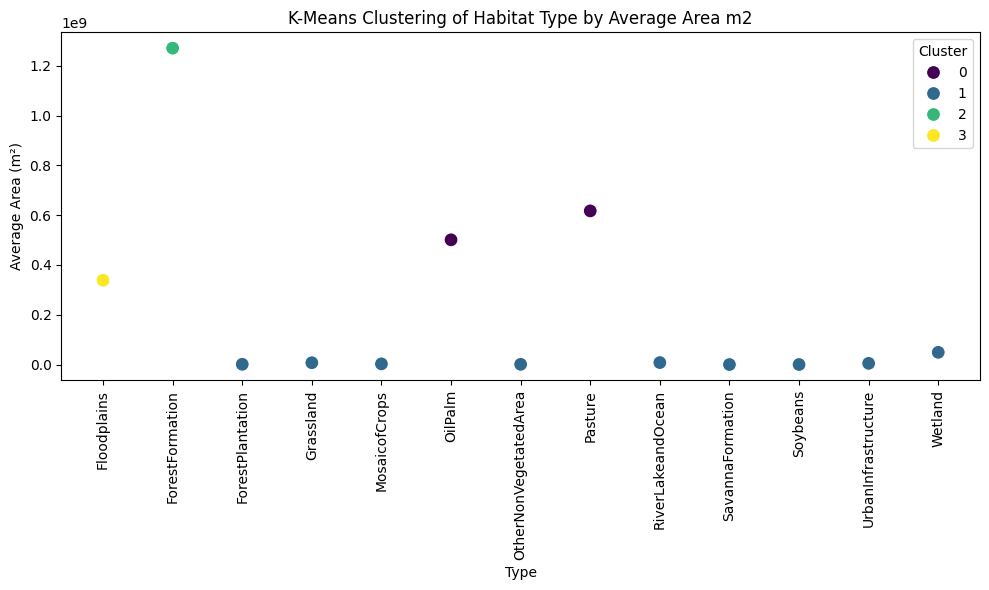
    


    
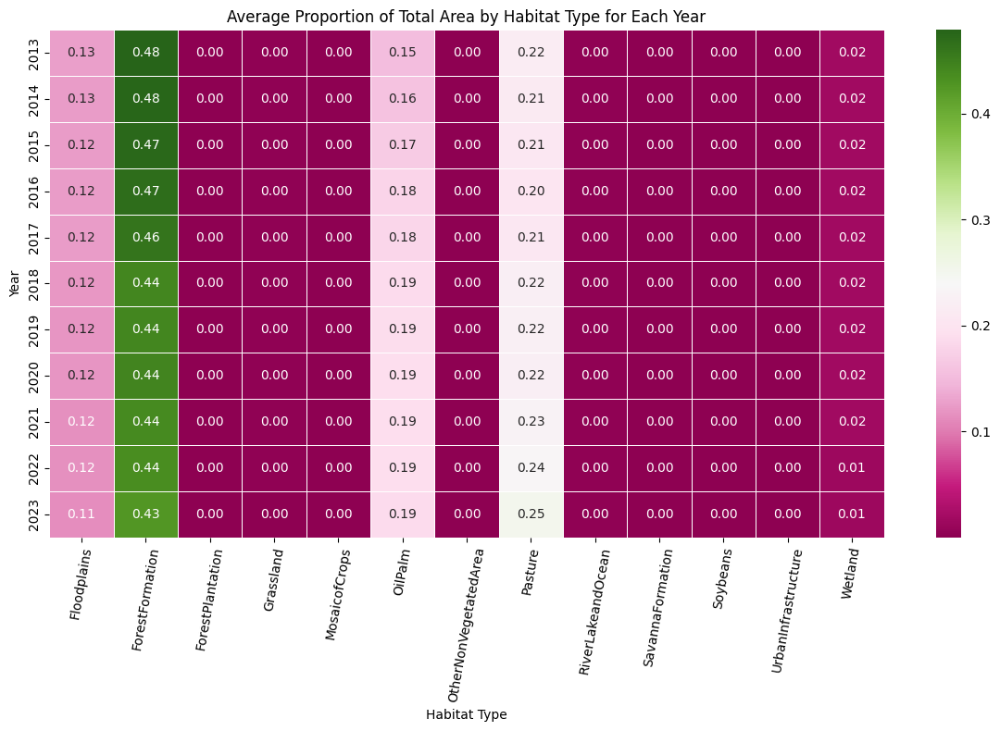
    


    ANOVA for Type:
    F-statistic: 3518.154323541889, p-value: 5.477677187641807e-157
    
    Tukey HSD Test for PLot:
                                Multiple Comparison of Means - Tukey HSD, FWER=0.05                             
    ============================================================================================================
            group1                group2            meandiff     p-adj       lower            upper       reject
    ------------------------------------------------------------------------------------------------------------
              Floodplains       ForestFormation   931911605.1337    0.0   901097892.8823   962725317.3851   True
              Floodplains      ForestPlantation  -337407734.4385    0.0  -368221446.6899  -306594022.1871   True
              Floodplains             Grassland  -331212437.3262    0.0  -362026149.5776  -300398725.0748   True
              Floodplains         MosaicofCrops  -335764870.5882    0.0  -366578582.8396  -304951158.3369   True
              Floodplains               OilPalm   162326971.4439    0.0   131513259.1925   193140683.6952   True
              Floodplains OtherNonVegetatedArea  -337603459.2513    0.0  -368417171.5027     -306789747.0   True
              Floodplains               Pasture   278428724.5989    0.0   247615012.3476   309242436.8503   True
              Floodplains     RiverLakeandOcean  -330588565.6684    0.0  -361402277.9198  -299774853.4171   True
              Floodplains      SavannaFormation  -338442160.7487    0.0     -369255873.0  -307628448.4973   True
              Floodplains              Soybeans  -338372746.8449    0.0  -369186459.0963  -307559034.5935   True
              Floodplains   UrbanInfrastructure  -333717815.2941    0.0  -364531527.5455  -302904103.0427   True
              Floodplains               Wetland  -289465026.0963    0.0  -320278738.3476  -258651313.8449   True
          ForestFormation      ForestPlantation -1269319339.5722    0.0 -1300133051.8236 -1238505627.3208   True
          ForestFormation             Grassland -1263124042.4599    0.0 -1293937754.7113 -1232310330.2085   True
          ForestFormation         MosaicofCrops -1267676475.7219    0.0 -1298490187.9733 -1236862763.4705   True
          ForestFormation               OilPalm  -769584633.6898    0.0  -800398345.9412  -738770921.4385   True
          ForestFormation OtherNonVegetatedArea  -1269515064.385    0.0 -1300328776.6364 -1238701352.1337   True
          ForestFormation               Pasture  -653482880.5348    0.0  -684296592.7861  -622669168.2834   True
          ForestFormation     RiverLakeandOcean -1262500170.8021    0.0 -1293313883.0535 -1231686458.5508   True
          ForestFormation      SavannaFormation -1270353765.8823    0.0 -1301167478.1337  -1239540053.631   True
          ForestFormation              Soybeans -1270284351.9786    0.0   -1301098064.23 -1239470639.7272   True
          ForestFormation   UrbanInfrastructure -1265629420.4278    0.0 -1296443132.6792 -1234815708.1764   True
          ForestFormation               Wetland -1221376631.2299    0.0 -1252190343.4813 -1190562918.9786   True
         ForestPlantation             Grassland     6195297.1123    1.0   -24618415.1391    37009009.3637  False
         ForestPlantation         MosaicofCrops     1642863.8503    1.0   -29170848.4011    32456576.1016  False
         ForestPlantation               OilPalm   499734705.8824    0.0    468920993.631   530548418.1337   True
         ForestPlantation OtherNonVegetatedArea     -195724.8128    1.0   -31009437.0642    30617987.4385  False
         ForestPlantation               Pasture   615836459.0374    0.0   585022746.7861   646650171.2888   True
         ForestPlantation     RiverLakeandOcean     6819168.7701 0.9999   -23994543.4813    37632881.0214  False
         ForestPlantation      SavannaFormation    -1034426.3102    1.0   -31848138.5615    29779285.9412  False
         ForestPlantation              Soybeans     -965012.4064    1.0   -31778724.6578     29848699.845  False
         ForestPlantation   UrbanInfrastructure     3689919.1444    1.0    -27123793.107    34503631.3958  False
         ForestPlantation               Wetland    47942708.3422    0.0    17128996.0909    78756420.5936   True
                Grassland         MosaicofCrops     -4552433.262    1.0   -35366145.5134    26261278.9893  False
                Grassland               OilPalm   493539408.7701    0.0   462725696.5187   524353121.0214   True
                Grassland OtherNonVegetatedArea    -6391021.9251    1.0   -37204734.1765    24422690.3262  False
                Grassland               Pasture   609641161.9251    0.0   578827449.6738   640454874.1765   True
                Grassland     RiverLakeandOcean      623871.6578    1.0   -30189840.5936    31437583.9091  False
                Grassland      SavannaFormation    -7229723.4225 0.9999   -38043435.6738    23583988.8289  False
                Grassland              Soybeans    -7160309.5187 0.9999   -37974021.7701    23653402.7327  False
                Grassland   UrbanInfrastructure    -2505377.9679    1.0   -33319090.2193    28308334.2835  False
                Grassland               Wetland    41747411.2299 0.0008    10933698.9786    72561123.4813   True
            MosaicofCrops               OilPalm   498091842.0321    0.0   467278129.7807   528905554.2835   True
            MosaicofCrops OtherNonVegetatedArea    -1838588.6631    1.0   -32652300.9145    28975123.5883  False
            MosaicofCrops               Pasture   614193595.1872    0.0   583379882.9358   645007307.4385   True
            MosaicofCrops     RiverLakeandOcean     5176304.9198    1.0   -25637407.3316    35990017.1712  False
            MosaicofCrops      SavannaFormation    -2677290.1604    1.0   -33491002.4118    28136422.0909  False
            MosaicofCrops              Soybeans    -2607876.2567    1.0   -33421588.5081    28205835.9947  False
            MosaicofCrops   UrbanInfrastructure     2047055.2941    1.0   -28766656.9573    32860767.5455  False
            MosaicofCrops               Wetland     46299844.492 0.0001    15486132.2406    77113556.7434   True
                  OilPalm OtherNonVegetatedArea  -499930430.6952    0.0  -530744142.9466  -469116718.4438   True
                  OilPalm               Pasture   116101753.1551    0.0    85288040.9037   146915465.4065   True
                  OilPalm     RiverLakeandOcean  -492915537.1123    0.0  -523729249.3637  -462101824.8609   True
                  OilPalm      SavannaFormation  -500769132.1925    0.0  -531582844.4439  -469955419.9411   True
                  OilPalm              Soybeans  -500699718.2888    0.0  -531513430.5401  -469886006.0374   True
                  OilPalm   UrbanInfrastructure   -496044786.738    0.0  -526858498.9893  -465231074.4866   True
                  OilPalm               Wetland  -451791997.5401    0.0  -482605709.7915  -420978285.2887   True
    OtherNonVegetatedArea               Pasture   616032183.8503    0.0   585218471.5989   646845896.1016   True
    OtherNonVegetatedArea     RiverLakeandOcean     7014893.5829 0.9999   -23798818.6685    37828605.8343  False
    OtherNonVegetatedArea      SavannaFormation     -838701.4973    1.0   -31652413.7487     29975010.754  False
    OtherNonVegetatedArea              Soybeans     -769287.5936    1.0    -31582999.845    30044424.6578  False
    OtherNonVegetatedArea   UrbanInfrastructure     3885643.9572    1.0   -26928068.2942    34699356.2086  False
    OtherNonVegetatedArea               Wetland    48138433.1551    0.0    17324720.9037    78952145.4065   True
                  Pasture     RiverLakeandOcean  -609017290.2674    0.0  -639831002.5188   -578203578.016   True
                  Pasture      SavannaFormation  -616870885.3476    0.0   -647684597.599  -586057173.0962   True
                  Pasture              Soybeans  -616801471.4438    0.0  -647615183.6952  -585987759.1925   True
                  Pasture   UrbanInfrastructure   -612146539.893    0.0  -642960252.1444  -581332827.6417   True
                  Pasture               Wetland  -567893750.6952    0.0  -598707462.9466  -537080038.4438   True
        RiverLakeandOcean      SavannaFormation    -7853595.0802 0.9997   -38667307.3316    22960117.1712  False
        RiverLakeandOcean              Soybeans    -7784181.1765 0.9997   -38597893.4278    23029531.0749  False
        RiverLakeandOcean   UrbanInfrastructure    -3129249.6257    1.0    -33942961.877    27684462.6257  False
        RiverLakeandOcean               Wetland    41123539.5722  0.001    10309827.3208    71937251.8236   True
         SavannaFormation              Soybeans       69413.9037    1.0   -30744298.3476    30883126.1551  False
         SavannaFormation   UrbanInfrastructure     4724345.4545    1.0   -26089366.7968    35538057.7059  False
         SavannaFormation               Wetland    48977134.6524    0.0     18163422.401    79790846.9038   True
                 Soybeans   UrbanInfrastructure     4654931.5508    1.0   -26158780.7006    35468643.8022  False
                 Soybeans               Wetland    48907720.7487    0.0    18094008.4973       79721433.0   True
      UrbanInfrastructure               Wetland    44252789.1979 0.0003    13439076.9465    75066501.4492   True
    ------------------------------------------------------------------------------------------------------------
    


    
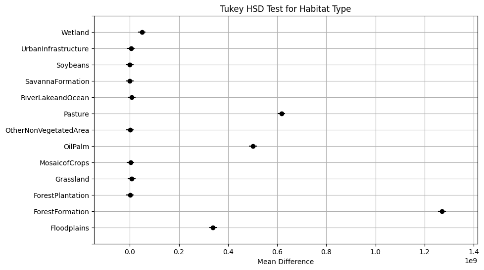
    


    
    ANOVA for Year:
    F-statistic: 4.867223506960202e-30, p-value: 1.0
    
    Tukey HSD Test for Year:
           Multiple Comparison of Means - Tukey HSD, FWER=0.05        
    ==================================================================
    group1 group2 meandiff p-adj      lower          upper      reject
    ------------------------------------------------------------------
      2013   2014      0.0   1.0 -492736391.7088 492736391.7088  False
      2013   2015      0.0   1.0 -492736391.7088 492736391.7088  False
      2013   2016     -0.0   1.0 -492736391.7088 492736391.7088  False
      2013   2017     -0.0   1.0 -492736391.7088 492736391.7088  False
      2013   2018      0.0   1.0 -492736391.7088 492736391.7088  False
      2013   2019     -0.0   1.0 -492736391.7088 492736391.7088  False
      2013   2020     -0.0   1.0 -492736391.7088 492736391.7088  False
      2013   2021     -0.0   1.0 -492736391.7088 492736391.7088  False
      2013   2022     -0.0   1.0 -492736391.7088 492736391.7088  False
      2013   2023      0.0   1.0 -492736391.7088 492736391.7088  False
      2014   2015      0.0   1.0 -492736391.7088 492736391.7088  False
      2014   2016     -0.0   1.0 -492736391.7088 492736391.7088  False
      2014   2017     -0.0   1.0 -492736391.7088 492736391.7088  False
      2014   2018      0.0   1.0 -492736391.7088 492736391.7088  False
      2014   2019     -0.0   1.0 -492736391.7088 492736391.7088  False
      2014   2020     -0.0   1.0 -492736391.7088 492736391.7088  False
      2014   2021     -0.0   1.0 -492736391.7088 492736391.7088  False
      2014   2022     -0.0   1.0 -492736391.7088 492736391.7088  False
      2014   2023      0.0   1.0 -492736391.7088 492736391.7088  False
      2015   2016     -0.0   1.0 -492736391.7088 492736391.7088  False
      2015   2017     -0.0   1.0 -492736391.7088 492736391.7088  False
      2015   2018      0.0   1.0 -492736391.7088 492736391.7088  False
      2015   2019     -0.0   1.0 -492736391.7088 492736391.7088  False
      2015   2020     -0.0   1.0 -492736391.7088 492736391.7088  False
      2015   2021     -0.0   1.0 -492736391.7088 492736391.7088  False
      2015   2022     -0.0   1.0 -492736391.7088 492736391.7088  False
      2015   2023     -0.0   1.0 -492736391.7088 492736391.7088  False
      2016   2017     -0.0   1.0 -492736391.7088 492736391.7088  False
      2016   2018      0.0   1.0 -492736391.7088 492736391.7088  False
      2016   2019     -0.0   1.0 -492736391.7088 492736391.7088  False
      2016   2020     -0.0   1.0 -492736391.7088 492736391.7088  False
      2016   2021     -0.0   1.0 -492736391.7088 492736391.7088  False
      2016   2022      0.0   1.0 -492736391.7088 492736391.7088  False
      2016   2023      0.0   1.0 -492736391.7088 492736391.7088  False
      2017   2018      0.0   1.0 -492736391.7088 492736391.7088  False
      2017   2019      0.0   1.0 -492736391.7088 492736391.7088  False
      2017   2020      0.0   1.0 -492736391.7088 492736391.7088  False
      2017   2021      0.0   1.0 -492736391.7088 492736391.7088  False
      2017   2022      0.0   1.0 -492736391.7088 492736391.7088  False
      2017   2023      0.0   1.0 -492736391.7088 492736391.7088  False
      2018   2019     -0.0   1.0 -492736391.7088 492736391.7088  False
      2018   2020     -0.0   1.0 -492736391.7088 492736391.7088  False
      2018   2021     -0.0   1.0 -492736391.7088 492736391.7088  False
      2018   2022     -0.0   1.0 -492736391.7088 492736391.7088  False
      2018   2023     -0.0   1.0 -492736391.7088 492736391.7088  False
      2019   2020     -0.0   1.0 -492736391.7088 492736391.7088  False
      2019   2021      0.0   1.0 -492736391.7088 492736391.7088  False
      2019   2022      0.0   1.0 -492736391.7088 492736391.7088  False
      2019   2023      0.0   1.0 -492736391.7088 492736391.7088  False
      2020   2021      0.0   1.0 -492736391.7088 492736391.7088  False
      2020   2022      0.0   1.0 -492736391.7088 492736391.7088  False
      2020   2023      0.0   1.0 -492736391.7088 492736391.7088  False
      2021   2022      0.0   1.0 -492736391.7088 492736391.7088  False
      2021   2023      0.0   1.0 -492736391.7088 492736391.7088  False
      2022   2023      0.0   1.0 -492736391.7088 492736391.7088  False
    ------------------------------------------------------------------
    


    
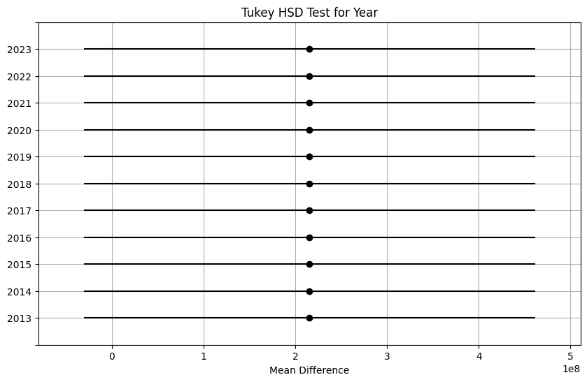
    


    C:\Users\vs24904\AppData\Local\anaconda32\Lib\site-packages\statsmodels\tsa\base\tsa_model.py:473: ValueWarning: An unsupported index was provided. As a result, forecasts cannot be generated. To use the model for forecasting, use one of the supported classes of index.
      self._init_dates(dates, freq)
    C:\Users\vs24904\AppData\Local\anaconda32\Lib\site-packages\statsmodels\tsa\base\tsa_model.py:473: ValueWarning: An unsupported index was provided. As a result, forecasts cannot be generated. To use the model for forecasting, use one of the supported classes of index.
      self._init_dates(dates, freq)
    C:\Users\vs24904\AppData\Local\anaconda32\Lib\site-packages\statsmodels\tsa\base\tsa_model.py:473: ValueWarning: An unsupported index was provided. As a result, forecasts cannot be generated. To use the model for forecasting, use one of the supported classes of index.
      self._init_dates(dates, freq)
    C:\Users\vs24904\AppData\Local\anaconda32\Lib\site-packages\statsmodels\tsa\base\tsa_model.py:837: ValueWarning: No supported index is available. Prediction results will be given with an integer index beginning at `start`.
      return get_prediction_index(
    C:\Users\vs24904\AppData\Local\anaconda32\Lib\site-packages\statsmodels\tsa\base\tsa_model.py:837: FutureWarning: No supported index is available. In the next version, calling this method in a model without a supported index will result in an exception.
      return get_prediction_index(
    


    
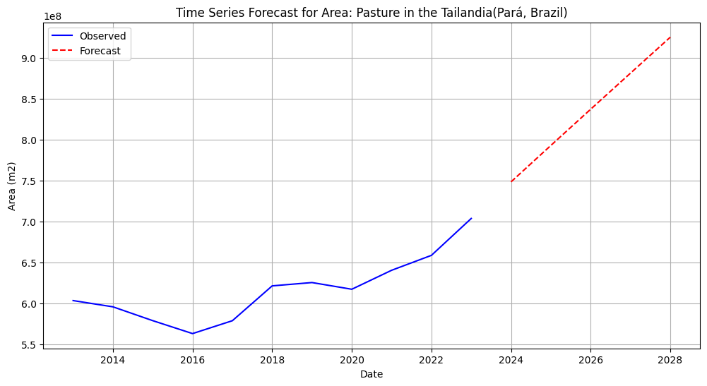
    


        Date  Forecasted_Area_m2
    11  2024        7.484357e+08
    12  2025        7.928831e+08
    13  2026        8.371145e+08
    14  2027        8.811696e+08
    15  2028        9.250809e+08
    MAE: 110300072.24824476
    MSE: 1.3826009542965576e+16
    RMSE: 117584053.09805228
    MAPE: nan%
    

    C:\Users\vs24904\AppData\Local\anaconda32\Lib\site-packages\statsmodels\tsa\base\tsa_model.py:473: ValueWarning: An unsupported index was provided. As a result, forecasts cannot be generated. To use the model for forecasting, use one of the supported classes of index.
      self._init_dates(dates, freq)
    C:\Users\vs24904\AppData\Local\anaconda32\Lib\site-packages\statsmodels\tsa\base\tsa_model.py:473: ValueWarning: An unsupported index was provided. As a result, forecasts cannot be generated. To use the model for forecasting, use one of the supported classes of index.
      self._init_dates(dates, freq)
    C:\Users\vs24904\AppData\Local\anaconda32\Lib\site-packages\statsmodels\tsa\base\tsa_model.py:473: ValueWarning: An unsupported index was provided. As a result, forecasts cannot be generated. To use the model for forecasting, use one of the supported classes of index.
      self._init_dates(dates, freq)
    C:\Users\vs24904\AppData\Local\anaconda32\Lib\site-packages\statsmodels\tsa\base\tsa_model.py:837: ValueWarning: No supported index is available. Prediction results will be given with an integer index beginning at `start`.
      return get_prediction_index(
    C:\Users\vs24904\AppData\Local\anaconda32\Lib\site-packages\statsmodels\tsa\base\tsa_model.py:837: FutureWarning: No supported index is available. In the next version, calling this method in a model without a supported index will result in an exception.
      return get_prediction_index(
    


    
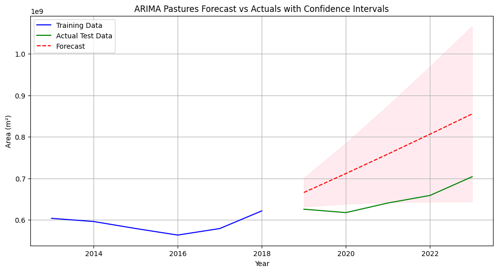
    


         Date BufferID                   Type       Area_m2
    0    2013   center                Wetland  5.228134e+07
    1    2013  center               Grassland  7.807045e+06
    2    2013  center                 Pasture  6.034558e+08
    3    2013  center     UrbanInfrastructure  4.611600e+06
    4    2013  center   OtherNonVegetatedArea  1.161000e+05
    ..    ...      ...                    ...           ...
    138  2023   center               Soybeans  7.334294e+05
    139  2023   center       SavannaFormation  1.215000e+05
    140  2023   center          MosaicofCrops  1.465211e+06
    141  2023   center            Floodplains  3.191143e+08
    142  2023   center       ForestPlantation  1.186906e+06
    
    [143 rows x 4 columns]
    

    C:\Users\vs24904\AppData\Local\anaconda32\Lib\site-packages\statsmodels\tsa\base\tsa_model.py:473: ValueWarning: An unsupported index was provided. As a result, forecasts cannot be generated. To use the model for forecasting, use one of the supported classes of index.
      self._init_dates(dates, freq)
    C:\Users\vs24904\AppData\Local\anaconda32\Lib\site-packages\statsmodels\tsa\base\tsa_model.py:473: ValueWarning: An unsupported index was provided. As a result, forecasts cannot be generated. To use the model for forecasting, use one of the supported classes of index.
      self._init_dates(dates, freq)
    C:\Users\vs24904\AppData\Local\anaconda32\Lib\site-packages\statsmodels\tsa\base\tsa_model.py:473: ValueWarning: An unsupported index was provided. As a result, forecasts cannot be generated. To use the model for forecasting, use one of the supported classes of index.
      self._init_dates(dates, freq)
    C:\Users\vs24904\AppData\Local\anaconda32\Lib\site-packages\statsmodels\tsa\statespace\sarimax.py:978: UserWarning: Non-invertible starting MA parameters found. Using zeros as starting parameters.
      warn('Non-invertible starting MA parameters found.'
    C:\Users\vs24904\AppData\Local\anaconda32\Lib\site-packages\statsmodels\tsa\base\tsa_model.py:837: ValueWarning: No supported index is available. Prediction results will be given with an integer index beginning at `start`.
      return get_prediction_index(
    C:\Users\vs24904\AppData\Local\anaconda32\Lib\site-packages\statsmodels\tsa\base\tsa_model.py:837: FutureWarning: No supported index is available. In the next version, calling this method in a model without a supported index will result in an exception.
      return get_prediction_index(
    


    
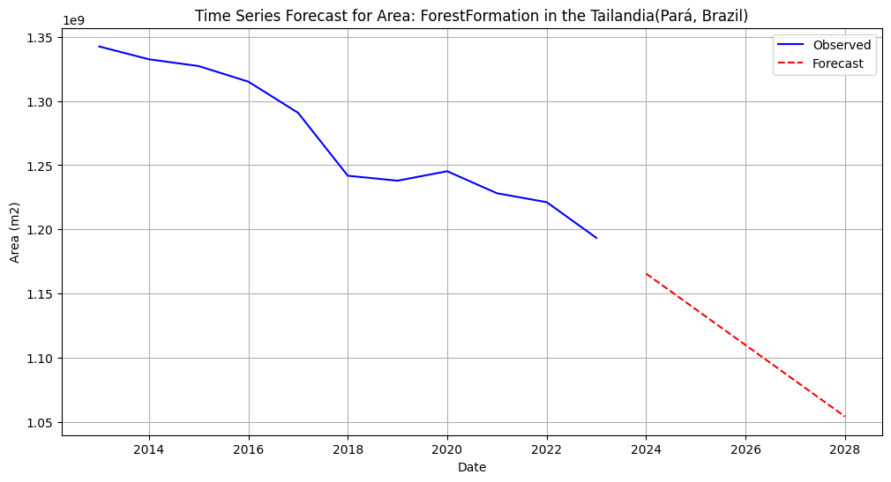
    


        Date  Forecasted_Area_m2
    11  2024        1.165483e+09
    12  2025        1.137640e+09
    13  2026        1.109796e+09
    14  2027        1.081950e+09
    15  2028        1.054104e+09
    MAE: 31708128.052738428
    MSE: 1251817592692463.8
    RMSE: 35381034.364366226
    MAPE: nan%
    

    C:\Users\vs24904\AppData\Local\anaconda32\Lib\site-packages\statsmodels\tsa\base\tsa_model.py:473: ValueWarning: An unsupported index was provided. As a result, forecasts cannot be generated. To use the model for forecasting, use one of the supported classes of index.
      self._init_dates(dates, freq)
    C:\Users\vs24904\AppData\Local\anaconda32\Lib\site-packages\statsmodels\tsa\base\tsa_model.py:473: ValueWarning: An unsupported index was provided. As a result, forecasts cannot be generated. To use the model for forecasting, use one of the supported classes of index.
      self._init_dates(dates, freq)
    C:\Users\vs24904\AppData\Local\anaconda32\Lib\site-packages\statsmodels\tsa\base\tsa_model.py:473: ValueWarning: An unsupported index was provided. As a result, forecasts cannot be generated. To use the model for forecasting, use one of the supported classes of index.
      self._init_dates(dates, freq)
    C:\Users\vs24904\AppData\Local\anaconda32\Lib\site-packages\statsmodels\tsa\statespace\sarimax.py:866: UserWarning: Too few observations to estimate starting parameters for ARMA and trend. All parameters except for variances will be set to zeros.
      warn('Too few observations to estimate starting parameters%s.'
    C:\Users\vs24904\AppData\Local\anaconda32\Lib\site-packages\statsmodels\tsa\base\tsa_model.py:837: ValueWarning: No supported index is available. Prediction results will be given with an integer index beginning at `start`.
      return get_prediction_index(
    C:\Users\vs24904\AppData\Local\anaconda32\Lib\site-packages\statsmodels\tsa\base\tsa_model.py:837: FutureWarning: No supported index is available. In the next version, calling this method in a model without a supported index will result in an exception.
      return get_prediction_index(
    


    
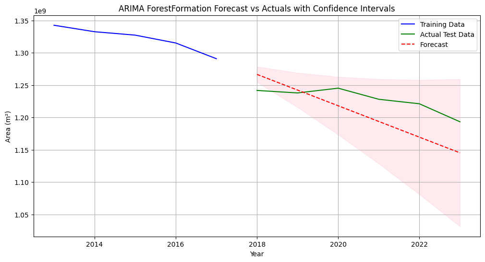
    


         Date BufferID                   Type       Area_m2
    0    2013   center                Wetland  5.228134e+07
    1    2013  center               Grassland  7.807045e+06
    2    2013  center                 Pasture  6.034558e+08
    3    2013  center     UrbanInfrastructure  4.611600e+06
    4    2013  center   OtherNonVegetatedArea  1.161000e+05
    ..    ...      ...                    ...           ...
    138  2023   center               Soybeans  7.334294e+05
    139  2023   center       SavannaFormation  1.215000e+05
    140  2023   center          MosaicofCrops  1.465211e+06
    141  2023   center            Floodplains  3.191143e+08
    142  2023   center       ForestPlantation  1.186906e+06
    
    [143 rows x 4 columns]
    

    C:\Users\vs24904\AppData\Local\anaconda32\Lib\site-packages\statsmodels\tsa\base\tsa_model.py:473: ValueWarning: An unsupported index was provided. As a result, forecasts cannot be generated. To use the model for forecasting, use one of the supported classes of index.
      self._init_dates(dates, freq)
    C:\Users\vs24904\AppData\Local\anaconda32\Lib\site-packages\statsmodels\tsa\base\tsa_model.py:473: ValueWarning: An unsupported index was provided. As a result, forecasts cannot be generated. To use the model for forecasting, use one of the supported classes of index.
      self._init_dates(dates, freq)
    C:\Users\vs24904\AppData\Local\anaconda32\Lib\site-packages\statsmodels\tsa\base\tsa_model.py:473: ValueWarning: An unsupported index was provided. As a result, forecasts cannot be generated. To use the model for forecasting, use one of the supported classes of index.
      self._init_dates(dates, freq)
    C:\Users\vs24904\AppData\Local\anaconda32\Lib\site-packages\statsmodels\tsa\statespace\sarimax.py:966: UserWarning: Non-stationary starting autoregressive parameters found. Using zeros as starting parameters.
      warn('Non-stationary starting autoregressive parameters'
    C:\Users\vs24904\AppData\Local\anaconda32\Lib\site-packages\statsmodels\tsa\statespace\sarimax.py:978: UserWarning: Non-invertible starting MA parameters found. Using zeros as starting parameters.
      warn('Non-invertible starting MA parameters found.'
    C:\Users\vs24904\AppData\Local\anaconda32\Lib\site-packages\statsmodels\tsa\base\tsa_model.py:837: ValueWarning: No supported index is available. Prediction results will be given with an integer index beginning at `start`.
      return get_prediction_index(
    C:\Users\vs24904\AppData\Local\anaconda32\Lib\site-packages\statsmodels\tsa\base\tsa_model.py:837: FutureWarning: No supported index is available. In the next version, calling this method in a model without a supported index will result in an exception.
      return get_prediction_index(
    


    
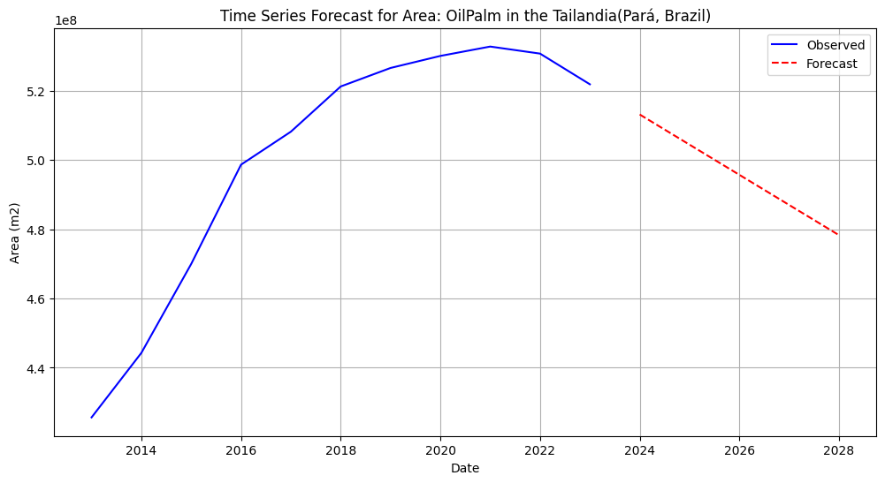
    


        Date  Forecasted_Area_m2
    11  2024        5.131608e+08
    12  2025        5.044460e+08
    13  2026        4.957316e+08
    14  2027        4.870173e+08
    15  2028        4.783029e+08
    MAE: 8671598.79203401
    MSE: 131579802076476.12
    RMSE: 11470823.94932797
    MAPE: nan%
    

    C:\Users\vs24904\AppData\Local\anaconda32\Lib\site-packages\statsmodels\tsa\base\tsa_model.py:473: ValueWarning: An unsupported index was provided. As a result, forecasts cannot be generated. To use the model for forecasting, use one of the supported classes of index.
      self._init_dates(dates, freq)
    C:\Users\vs24904\AppData\Local\anaconda32\Lib\site-packages\statsmodels\tsa\base\tsa_model.py:473: ValueWarning: An unsupported index was provided. As a result, forecasts cannot be generated. To use the model for forecasting, use one of the supported classes of index.
      self._init_dates(dates, freq)
    C:\Users\vs24904\AppData\Local\anaconda32\Lib\site-packages\statsmodels\tsa\base\tsa_model.py:473: ValueWarning: An unsupported index was provided. As a result, forecasts cannot be generated. To use the model for forecasting, use one of the supported classes of index.
      self._init_dates(dates, freq)
    C:\Users\vs24904\AppData\Local\anaconda32\Lib\site-packages\statsmodels\tsa\statespace\sarimax.py:966: UserWarning: Non-stationary starting autoregressive parameters found. Using zeros as starting parameters.
      warn('Non-stationary starting autoregressive parameters'
    C:\Users\vs24904\AppData\Local\anaconda32\Lib\site-packages\statsmodels\tsa\statespace\sarimax.py:978: UserWarning: Non-invertible starting MA parameters found. Using zeros as starting parameters.
      warn('Non-invertible starting MA parameters found.'
    C:\Users\vs24904\AppData\Local\anaconda32\Lib\site-packages\statsmodels\tsa\base\tsa_model.py:837: ValueWarning: No supported index is available. Prediction results will be given with an integer index beginning at `start`.
      return get_prediction_index(
    C:\Users\vs24904\AppData\Local\anaconda32\Lib\site-packages\statsmodels\tsa\base\tsa_model.py:837: FutureWarning: No supported index is available. In the next version, calling this method in a model without a supported index will result in an exception.
      return get_prediction_index(
    


    
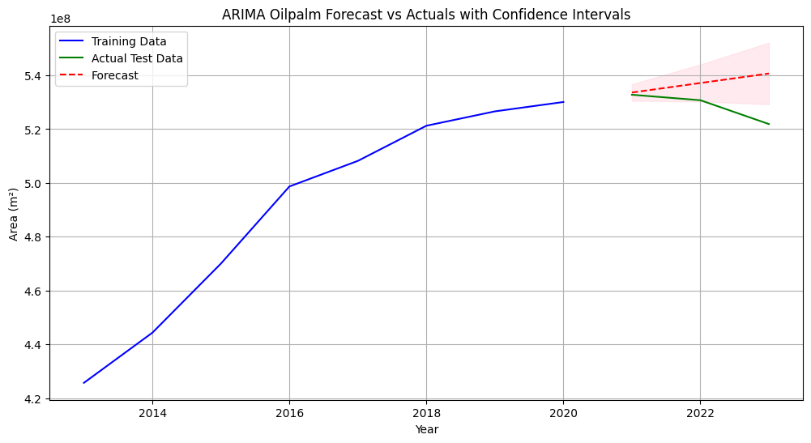
    


    C:\Users\vs24904\AppData\Local\anaconda32\Lib\site-packages\statsmodels\tsa\base\tsa_model.py:473: ValueWarning: An unsupported index was provided. As a result, forecasts cannot be generated. To use the model for forecasting, use one of the supported classes of index.
      self._init_dates(dates, freq)
    C:\Users\vs24904\AppData\Local\anaconda32\Lib\site-packages\statsmodels\tsa\base\tsa_model.py:473: ValueWarning: An unsupported index was provided. As a result, forecasts cannot be generated. To use the model for forecasting, use one of the supported classes of index.
      self._init_dates(dates, freq)
    C:\Users\vs24904\AppData\Local\anaconda32\Lib\site-packages\statsmodels\tsa\base\tsa_model.py:473: ValueWarning: An unsupported index was provided. As a result, forecasts cannot be generated. To use the model for forecasting, use one of the supported classes of index.
      self._init_dates(dates, freq)
    C:\Users\vs24904\AppData\Local\anaconda32\Lib\site-packages\statsmodels\tsa\base\tsa_model.py:837: ValueWarning: No supported index is available. Prediction results will be given with an integer index beginning at `start`.
      return get_prediction_index(
    C:\Users\vs24904\AppData\Local\anaconda32\Lib\site-packages\statsmodels\tsa\base\tsa_model.py:837: FutureWarning: No supported index is available. In the next version, calling this method in a model without a supported index will result in an exception.
      return get_prediction_index(
    


    
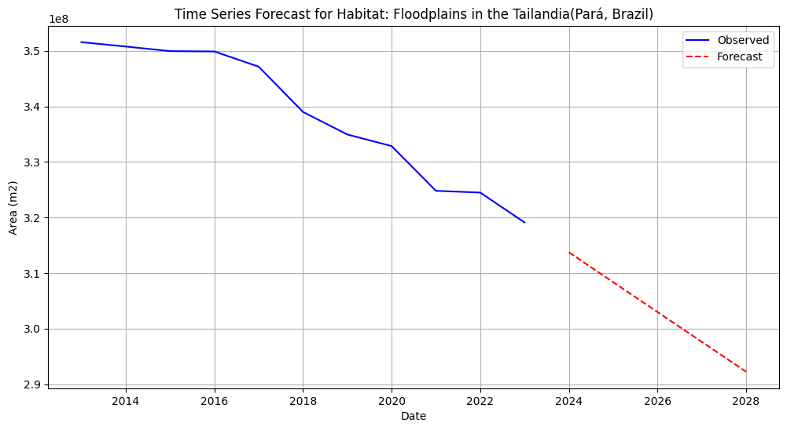
    


        Date  Forecasted_Area_m2
    11  2024        3.137402e+08
    12  2025        3.083666e+08
    13  2026        3.029931e+08
    14  2027        2.976197e+08
    15  2028        2.922462e+08
    MAE: 5666639.169054608
    MSE: 33763819493611.793
    RMSE: 5810664.2902177535
    MAPE: nan%
    

    C:\Users\vs24904\AppData\Local\anaconda32\Lib\site-packages\statsmodels\tsa\base\tsa_model.py:473: ValueWarning: An unsupported index was provided. As a result, forecasts cannot be generated. To use the model for forecasting, use one of the supported classes of index.
      self._init_dates(dates, freq)
    C:\Users\vs24904\AppData\Local\anaconda32\Lib\site-packages\statsmodels\tsa\base\tsa_model.py:473: ValueWarning: An unsupported index was provided. As a result, forecasts cannot be generated. To use the model for forecasting, use one of the supported classes of index.
      self._init_dates(dates, freq)
    C:\Users\vs24904\AppData\Local\anaconda32\Lib\site-packages\statsmodels\tsa\base\tsa_model.py:473: ValueWarning: An unsupported index was provided. As a result, forecasts cannot be generated. To use the model for forecasting, use one of the supported classes of index.
      self._init_dates(dates, freq)
    C:\Users\vs24904\AppData\Local\anaconda32\Lib\site-packages\statsmodels\tsa\statespace\sarimax.py:978: UserWarning: Non-invertible starting MA parameters found. Using zeros as starting parameters.
      warn('Non-invertible starting MA parameters found.'
    C:\Users\vs24904\AppData\Local\anaconda32\Lib\site-packages\statsmodels\tsa\base\tsa_model.py:837: ValueWarning: No supported index is available. Prediction results will be given with an integer index beginning at `start`.
      return get_prediction_index(
    C:\Users\vs24904\AppData\Local\anaconda32\Lib\site-packages\statsmodels\tsa\base\tsa_model.py:837: FutureWarning: No supported index is available. In the next version, calling this method in a model without a supported index will result in an exception.
      return get_prediction_index(
    


    
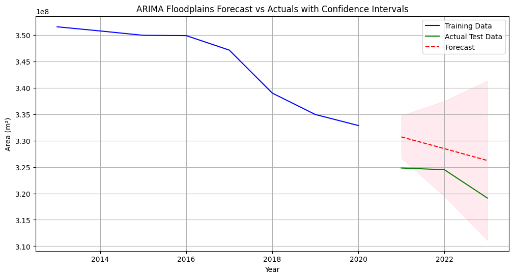
    


    C:\Users\vs24904\AppData\Local\anaconda32\Lib\site-packages\scipy\stats\_axis_nan_policy.py:430: UserWarning: `kurtosistest` p-value may be inaccurate with fewer than 20 observations; only n=11 observations were given.
      return hypotest_fun_in(*args, **kwds)
    


    
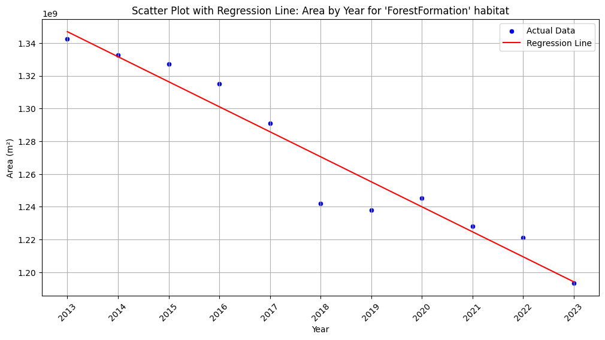
    


                                OLS Regression Results                            
    ==============================================================================
    Dep. Variable:                Area_m2   R-squared:                       0.939
    Model:                            OLS   Adj. R-squared:                  0.932
    Method:                 Least Squares   F-statistic:                     138.8
    Date:                Tue, 14 Jan 2025   Prob (F-statistic):           9.02e-07
    Time:                        12:51:59   Log-Likelihood:                -195.19
    No. Observations:                  11   AIC:                             394.4
    Df Residuals:                       9   BIC:                             395.2
    Df Model:                           1                                         
    Covariance Type:            nonrobust                                         
    ====================================================================================
                           coef    std err          t      P>|t|      [0.025      0.975]
    ------------------------------------------------------------------------------------
    const             1.347e+09   7.68e+06    175.484      0.000    1.33e+09    1.36e+09
    BufferID_encoded -1.528e+07    1.3e+06    -11.780      0.000   -1.82e+07   -1.23e+07
    ==============================================================================
    Omnibus:                        5.232   Durbin-Watson:                   1.340
    Prob(Omnibus):                  0.073   Jarque-Bera (JB):                2.380
    Skew:                          -1.125   Prob(JB):                        0.304
    Kurtosis:                       3.357   Cond. No.                         11.3
    ==============================================================================
    
    Notes:
    [1] Standard Errors assume that the covariance matrix of the errors is correctly specified.
    

    C:\Users\vs24904\AppData\Local\anaconda32\Lib\site-packages\scipy\stats\_axis_nan_policy.py:430: UserWarning: `kurtosistest` p-value may be inaccurate with fewer than 20 observations; only n=11 observations were given.
      return hypotest_fun_in(*args, **kwds)
    


    
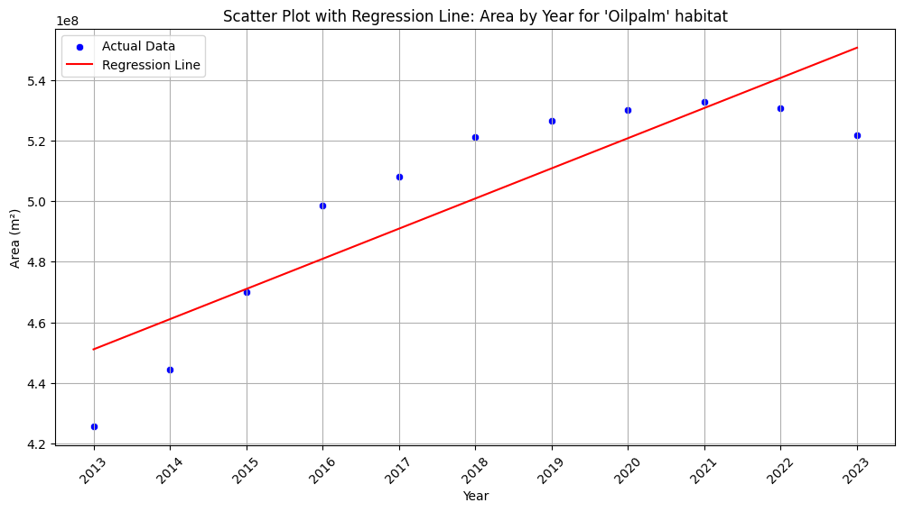
    


                                OLS Regression Results                            
    ==============================================================================
    Dep. Variable:                Area_m2   R-squared:                       0.772
    Model:                            OLS   Adj. R-squared:                  0.747
    Method:                 Least Squares   F-statistic:                     30.53
    Date:                Tue, 14 Jan 2025   Prob (F-statistic):           0.000368
    Time:                        12:51:59   Log-Likelihood:                -198.82
    No. Observations:                  11   AIC:                             401.6
    Df Residuals:                       9   BIC:                             402.4
    Df Model:                           1                                         
    Covariance Type:            nonrobust                                         
    ====================================================================================
                           coef    std err          t      P>|t|      [0.025      0.975]
    ------------------------------------------------------------------------------------
    const             4.511e+08   1.07e+07     42.268      0.000    4.27e+08    4.75e+08
    BufferID_encoded  9.968e+06    1.8e+06      5.526      0.000    5.89e+06     1.4e+07
    ==============================================================================
    Omnibus:                        1.989   Durbin-Watson:                   0.403
    Prob(Omnibus):                  0.370   Jarque-Bera (JB):                1.051
    Skew:                          -0.408   Prob(JB):                        0.591
    Kurtosis:                       1.725   Cond. No.                         11.3
    ==============================================================================
    
    Notes:
    [1] Standard Errors assume that the covariance matrix of the errors is correctly specified.
    

    C:\Users\vs24904\AppData\Local\anaconda32\Lib\site-packages\scipy\stats\_axis_nan_policy.py:430: UserWarning: `kurtosistest` p-value may be inaccurate with fewer than 20 observations; only n=11 observations were given.
      return hypotest_fun_in(*args, **kwds)
    


    

    


                                OLS Regression Results                            
    ==============================================================================
    Dep. Variable:                Area_m2   R-squared:                       0.664
    Model:                            OLS   Adj. R-squared:                  0.627
    Method:                 Least Squares   F-statistic:                     17.78
    Date:                Tue, 14 Jan 2025   Prob (F-statistic):            0.00225
    Time:                        12:51:59   Log-Likelihood:                -201.75
    No. Observations:                  11   AIC:                             407.5
    Df Residuals:                       9   BIC:                             408.3
    Df Model:                           1                                         
    Covariance Type:            nonrobust                                         
    ====================================================================================
                           coef    std err          t      P>|t|      [0.025      0.975]
    ------------------------------------------------------------------------------------
    const             5.674e+08   1.39e+07     40.728      0.000    5.36e+08    5.99e+08
    BufferID_encoded  9.929e+06   2.35e+06      4.217      0.002     4.6e+06    1.53e+07
    ==============================================================================
    Omnibus:                        0.401   Durbin-Watson:                   0.842
    Prob(Omnibus):                  0.818   Jarque-Bera (JB):                0.492
    Skew:                           0.278   Prob(JB):                        0.782
    Kurtosis:                       2.126   Cond. No.                         11.3
    ==============================================================================
    
    Notes:
    [1] Standard Errors assume that the covariance matrix of the errors is correctly specified.
    

    C:\Users\vs24904\AppData\Local\anaconda32\Lib\site-packages\scipy\stats\_axis_nan_policy.py:430: UserWarning: `kurtosistest` p-value may be inaccurate with fewer than 20 observations; only n=11 observations were given.
      return hypotest_fun_in(*args, **kwds)
    


    
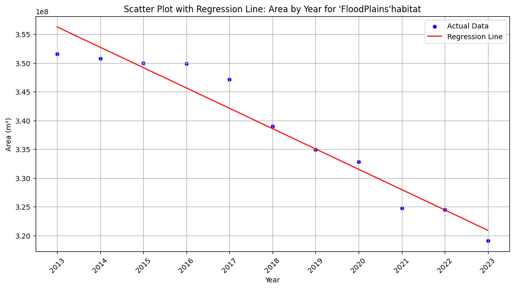
    


                                OLS Regression Results                            
    ==============================================================================
    Dep. Variable:                Area_m2   R-squared:                       0.942
    Model:                            OLS   Adj. R-squared:                  0.935
    Method:                 Least Squares   F-statistic:                     145.8
    Date:                Tue, 14 Jan 2025   Prob (F-statistic):           7.30e-07
    Time:                        12:52:00   Log-Likelihood:                -178.82
    No. Observations:                  11   AIC:                             361.6
    Df Residuals:                       9   BIC:                             362.4
    Df Model:                           1                                         
    Covariance Type:            nonrobust                                         
    ====================================================================================
                           coef    std err          t      P>|t|      [0.025      0.975]
    ------------------------------------------------------------------------------------
    const             3.563e+08   1.73e+06    205.574      0.000    3.52e+08     3.6e+08
    BufferID_encoded -3.537e+06   2.93e+05    -12.074      0.000    -4.2e+06   -2.87e+06
    ==============================================================================
    Omnibus:                        0.179   Durbin-Watson:                   1.005
    Prob(Omnibus):                  0.914   Jarque-Bera (JB):                0.258
    Skew:                           0.228   Prob(JB):                        0.879
    Kurtosis:                       2.403   Cond. No.                         11.3
    ==============================================================================
    
    Notes:
    [1] Standard Errors assume that the covariance matrix of the errors is correctly specified.
    
